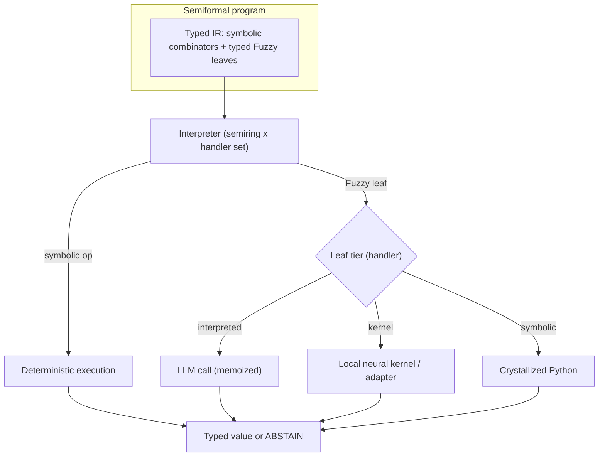

# Programmable Neural Programs

## Summary

Make the neural component of a semiformal program a **typed, composable hole** inside a formal
program, executed by a purpose-built neurosymbolic interpreter — rather than a monolithic compiled
artifact. Program structure (types, containers, control flow, composition) lives in a symbolic typed
IR; neural computation is confined to typed leaves `spec : InType -> OutType`. This yields three
properties a whole-function neural artifact cannot: shape-invariance (a scalar leaf lifts over
containers with no recompile), reversible solidification (a leaf matures from LLM call toward local
kernel toward symbolic code over its lifetime), and compositional reliability (per-leaf blame,
abstention, and construction-time type guarantees). The system is also the substance of a research
contribution.

---

## Problem Frame

Program-as-Weights (PAW, arXiv:2607.02512) compiles a natural-language spec once into a local neural
artifact and reuses it offline — a strong answer to the cost and reproducibility problems of calling
a remote LLM per input. But the program's *structure* lives inside the artifact: control flow,
composition, and fuzzy judgment are fused into one opaque blob. PAW's own limitations section names
the three consequences. It is single-step — its multi-function demo stitched ten artifacts together
with hand-written Python and regex glue. It is an opaque neural binary — only a short pseudo-program
is inspectable, and the paper calls tools for debugging such binaries an open problem. And each
artifact is welded to one fixed input shape: applying a `str` sentiment function to a `list[str]`
requires recompiling.

Current semipy sits at the opposite pole. It generates symbolic Python per slot and already carries
the machinery PAW lacks — a version-control DAG, a behavioral contract, a sketch library for
parametric reuse, reactivity, and an interpreted mode that runs an LLM per call until a slot becomes
shape-stable. But its neural involvement is confined to generation time; the runtime program is pure
Python, so there is no first-class notion of a neural component that is itself composed, typed,
versioned, and refined.

The opening is the gap between them: a program that is *partially neural at runtime* yet remains an
actual, controllable program — where the irreducibly-fuzzy work stays neural but everything else is
formal, inspectable, and editable, and where semipy's iteration machinery operates on the neural
parts as first-class artifacts.

---

## Key Decisions

- **Symbolic control, neural confined to typed leaves.** Every prior neurosymbolic system that
  worked at multi-step composition (Binder, ViperGPT, VisProg, Code-as-Policies, Scallop) put control
  flow in a symbolic host; the one that put control in a neural controller (Neural
  Programmer-Interpreters) needed full execution-trace supervision and generalized poorly. Control
  flow lives in a symbolic evaluator; leaves are the only neural nodes.

- **One interpreter, parameterized by an execution semiring and an effect-handler set.** A leaf is an
  algebraic effect; its maturity tier is which handler runs the effect. The same evaluator then serves
  concrete execution, confidence-tracking, and candidate-set exploration, and solidification becomes a
  handler swap rather than a separate code path.

- **A combinator core as the formal IR, with Python-pattern lowering as the surface.** The formal
  object is a small typed combinator IR (`map`/`traverse`/`filter`/`fold`/`branch`/`compose` plus a
  typed `Fuzzy` leaf), over which the lift, the `cata`-of-`fmap` factoring, blame monitoring, and
  run-past-unresolved-holes semantics are provable. Users keep writing Python around `#>` slots; a
  lowering recognizes map/filter/fold shapes and lifts them into the core, falling back to opaque
  blocks elsewhere. Guarantees hold inside the recognized region — which is where the headline claims
  live — so semipy's Python-surround identity is preserved.

- **Minimize neural surface area via a factoring rule.** Most "holistic" tasks are not irreducible;
  they factor as `cata(formal) . fmap(neural-leaf)` — `rank = sort . map(score)`. Push the neural leaf
  as deep as possible; only sibling-dependent residue stays a neural aggregate leaf.

- **Staged leaf substrate; do not rebuild PAW's compiler.** v1 uses interpreted-LLM leaves plus
  constrained decoding and the solidification lattice — no bespoke model. A hypernetwork
  spec-to-adapter compiler (Text-to-LoRA style) is the local-kernel tier, added only when the offline
  story is needed. Reconstructing PAW's compiler and 10M-example dataset is not the novelty.

- **A reversible lattice, not one-way promotion.** Solidification is tiered compilation for semantics
  with JIT-style deopt guards: a crystallized leaf falls back to a higher tier on a contract violation
  or out-of-distribution input.

- **Lead with shape-invariance; frame for the ML/NLP field.** The headline is shape-invariance — the
  most falsifiable claim and the cleanest delta over PAW — with solidification and compositional
  reliability as consequence sections. Benchmarks are load-bearing; the PL formalism (contextual-modal
  holes, the lift condition, blame) supplies rigor, not the target venue.

---

## Requirements

**Typed neural hole and interpreter**

- R1. A semiformal program lowers to a typed IR of symbolic combinators and typed fuzzy leaves
  (`spec : InType -> OutType`), where each leaf's type is derived from its formal surround, not
  declared by the user.
- R2. A single interpreter, parameterized by an execution semiring and an effect-handler set,
  evaluates the IR — symbolic ops deterministically, fuzzy leaves via the active handler — and supports
  concrete, confidence-tracking, and candidate-set modes over the same IR.
- R3. The interpreter evaluates past an unresolved leaf to an indeterminate value carrying a hole
  closure (its captured typed environment), so the formal surround still computes; resolving a leaf
  resumes from the closure rather than re-running the program.

**Shape-invariance**

- R4. A scalar leaf lifts over a container (list, optional, dict-values, dataframe column, tree) via a
  `Lift` IR node with no recompilation of the leaf artifact.
- R5. The system classifies an operator as element-wise (liftable) or irreducibly aggregate by a
  decidable test — singleton-determinacy plus commutation with reindexing — that is runtime-checkable as
  a permutation-invariance metamorphic contract.
- R6. Fuzzy operators are normalized toward `cata(formal) . fmap(neural-leaf)`, leaving only
  sibling-dependent residue as a neural aggregate leaf.

**Solidification lattice**

- R7. Each leaf occupies a state on a lattice (interpreted-LLM, local neural kernel, symbolic code) and
  may move in either direction; a crystallized leaf keeps a deopt guard that falls back to a higher tier
  on a contract violation or out-of-distribution input.
- R8. Crystallization toward symbolic is gated by a description-length objective measured across the
  portal, not a fixed reuse count; a leaf that keeps yielding discriminating counterexamples does not
  crystallize.
- R9. A crystallized or cached leaf carries a natural-language description so the reuse judge and sketch
  retrieval can match new specs by meaning.

**Compositional reliability**

- R10. Every leaf is a contract boundary labeled by its commit/site id; where the interpreter owns the
  logits, the leaf's declared type is guaranteed by constrained decoding, otherwise enforced by
  validate-repair-retry, otherwise the leaf abstains.
- R11. A leaf may return `ABSTAIN` as a first-class IR value that short-circuits composition instead of
  emitting a wrong-but-typed value.
- R12. When a composed program fails an end-to-end contract case, replaying the trace over the IR
  localizes blame to the first leaf whose monitor (type contract plus metamorphic relations) fails,
  without ground truth on intermediate values.

**Iteration on the neural artifact**

- R13. A leaf's neural specialization is computed once from its spec and reused across runtime inputs;
  specializations are cached keyed on the spec's durable-meaning embedding and substituted (INSTANTIATE)
  when a new leaf matches.
- R14. Composition of leaves is realized by sequencing typed calls, each loading its own specialization,
  not by merging weights; genuinely entangled specs use learned fusion behind a verify gate.
- R15. Editing the formal surround leaves neural leaves untouched with no recompile; editing a leaf's
  scalar spec recompiles only that leaf; reactivity invalidates only downstream consumers of a changed
  leaf.

---

## Key Flows

- F1. First execution of a fuzzy program
  - **Trigger:** A semiformal program with unresolved leaves runs for the first time.
  - **Steps:** Lower to the typed IR; the interpreter executes symbolic ops and, per leaf, resolves the
    active handler (interpreted-LLM by default), validating each leaf output against its type; cache the
    resolved leaves and the execution trace.
  - **Covers R1, R2, R3, R10.**

- F2. Shape change without recompile
  - **Trigger:** A leaf typed `str -> Label` is applied to a `list[str]`.
  - **Steps:** Lowering wraps the unchanged leaf in a `Lift` node (frame = list, cell = leaf); the
    element-wise test passes, so the interpreter maps the leaf over cells; no leaf recompilation occurs.
  - **Covers R4, R5, R15.**

- F3. Solidification over a leaf's lifetime
  - **Trigger:** A leaf accumulates shape-stable executions.
  - **Steps:** The description-length gate and counterexample check decide whether to crystallize toward
    a local kernel or symbolic code; the crystallized leaf keeps a deopt guard; an out-of-distribution
    input trips the guard and falls back to a higher tier, re-collecting examples.
  - **Covers R7, R8, R9.**

- F4. Composed failure to targeted regeneration
  - **Trigger:** A multi-leaf program fails an end-to-end contract case.
  - **Steps:** Replay the trace over the IR; the first leaf whose monitor fails is blamed; a
    contract-violating value regenerates that leaf (positive blame), an abstention signals an
    under-specified spec/context (negative blame).
  - **Covers R11, R12.**

---

## Acceptance Examples

- AE1. Element-wise lift, no recompile
  - **Covers R4, R5.**
  - **Given** a compiled leaf `sentiment : str -> Label` and input `["good", "awful"]`,
  - **When** the program applies it to the list,
  - **Then** the leaf artifact is unchanged, the output is `[POS, NEG]`, and no compile step runs.

- AE2. Aggregate operator is not lifted
  - **Covers R5, R6.**
  - **Given** the spec "pick the most representative review from the list",
  - **When** the element-wise test runs (permutation of the input changes the output),
  - **Then** the operator is classified irreducibly aggregate and realized as a `[str] -> str` leaf, not
    a lift of a scalar leaf.

- AE3. Abstention short-circuits composition
  - **Covers R11.**
  - **Given** a leaf whose confidence for an input is below its contract's risk threshold,
  - **When** the interpreter executes it,
  - **Then** the leaf returns `ABSTAIN`, downstream leaves are skipped, and no wrong-but-typed value
    propagates.

- AE4. Blame localization without intermediate ground truth
  - **Covers R12.**
  - **Given** a three-leaf pipeline that fails an end-to-end contract case, with ground-truth only on the
    final output,
  - **When** the trace is replayed over the IR,
  - **Then** the first leaf whose monitor (type contract or metamorphic relation) fails is reported as
    the blamed leaf.

---

## Success Criteria

The work substantiates three claims, each with a formal spine and an empirical test:

- **Shape-invariance leg.** On FuzzyBench-derived tasks wrapped in container and arity variations, the
  typed-hole system incurs zero leaf recompilation across shape changes that force PAW to recompile,
  with no accuracy regression on the element-wise subset. The element-wise/aggregate classifier's
  decisions match the formal test.
- **Solidification leg.** Over a slot's lifetime, a measurable fraction of leaves crystallize toward
  cheaper tiers with maintained contract pass-rates, and irreducibly-fuzzy leaves (summarize, judge)
  correctly never crystallize; deopt guards catch injected out-of-distribution inputs.
- **Compositional-reliability leg.** PAW's ten-function tool-calling pipeline, reimplemented as one
  composed typed-hole program, eliminates the hand-written glue and localizes an injected fault to the
  correct leaf.
- **Framing quality.** The contribution reads as a coherent abstraction (a typed neural hole that
  composes and solidifies), not a metric tweak, and the element-wise/aggregate boundary is stated as a
  named, decidable sub-result rather than a hand-waved caveat.

---

## Scope Boundaries

**Deferred for later**

- Training a bespoke small interpreter model or a custom spec-to-adapter compiler; v1 stands on released
  small models and adapters.
- Multimodal leaves; differentiable end-to-end training of the composed program.
- Long-horizon / agentic control loops beyond bounded recursive leaf decomposition.

**Outside this product's identity**

- Rebuilding PAW (its compiler, its 10M-example dataset, its offline-interpreter benchmark). PAW is a
  cited backend and baseline, not a reconstruction target.
- A neural controller that owns control flow — the rejected fork.
- A general agent framework; the unit is a typed hole in a program, not an autonomous agent.

---

## Dependencies / Assumptions

- Constrained decoding for guaranteed-by-construction type validity assumes the interpreter owns the
  leaf's logits (local models); closed-API leaves degrade to validate-repair-retry then abstain.
- The shape-invariance payoff assumes element-wise leaves are common; the factoring rule is what keeps
  that assumption broad by extracting scalar leaves from apparently-holistic tasks.
- Blame localization assumes adequate per-leaf contract and metamorphic-relation coverage; no contract,
  no blame.
- Type-validity is not semantic-correctness — a constrained leaf can still emit a valid-but-wrong value,
  so constrained decoding is always paired with abstention and contracts.
- The local-kernel tier depends on released artifacts (PAW interpreter/adapters, a Text-to-LoRA-style
  hypernetwork).

---

## Outstanding Questions

**Deferred to planning**

- Exact benchmark construction from FuzzyBench and the composed-pipeline reimplementation.
- Which container functors to support first (list and optional are the minimum).
- The out-of-distribution detection mechanism behind a leaf's deopt guard.
- The Python-to-combinator lowering's recognition boundary: which control-flow shapes lift into the
  core versus fall back to opaque blocks.

---

## Sources / Research

- Design-inspiration digest with the full mechanism catalog (TAKE/ADAPT/LEAVE) and ~35 citations across
  six streams: `docs/brainstorms/2026-07-03-programmable-neural-programs-design-inspiration.md`.
- Anchor paper: Program-as-Weights (PAW), arXiv:2607.02512.
- Load-bearing external grounding by design area:
  - IR / typed holes: Hazel (arXiv:1805.00155), Smyth (arXiv:1911.00583), GHC/Agda typed holes.
  - Interpreter: Binder (arXiv:2210.02875), Scallop (arXiv:2304.04812), Neural Module Networks
    (arXiv:1511.02799); NPI (arXiv:1511.06279) as the rejected fork.
  - Lift: Naperian functors (Gibbons, ESOP 2017), Remora (arXiv:1912.13451), Applicative Programming
    with Effects (McBride & Paterson, JFP 2008), Theorems for Free! (Wadler, FPCA 1989).
  - Substrate: Text-to-LoRA (arXiv:2506.06105), HINT (arXiv:2212.10315); TIES-Merging
    (arXiv:2306.01708) as the do-not-merge-weights lesson.
  - Solidification: DreamCoder (arXiv:2006.08381), Stitch (arXiv:2211.16605), LILO (arXiv:2310.19791),
    ALCHEmist (arXiv:2407.11004), RNN-to-DFA extraction (arXiv:1711.09576).
  - Reliability: Outlines (arXiv:2307.09702), grammar-constrained decoding (arXiv:2305.13971), contracts
    and blame (Findler & Felleisen ICFP 2002; Wadler & Findler ESOP 2009), selective classification
    (arXiv:1705.08500).
- Relevant semipy subsystems the design extends: interpreted mode (`semipy/interpreted.py`), sketch
  library (`semipy/library/`), reactivity (`semipy/reactivity/`), behavioral contract
  (`semipy/contract/`), effects (`semipy/effects/`), version-control DAG (`semipy/history/`).
