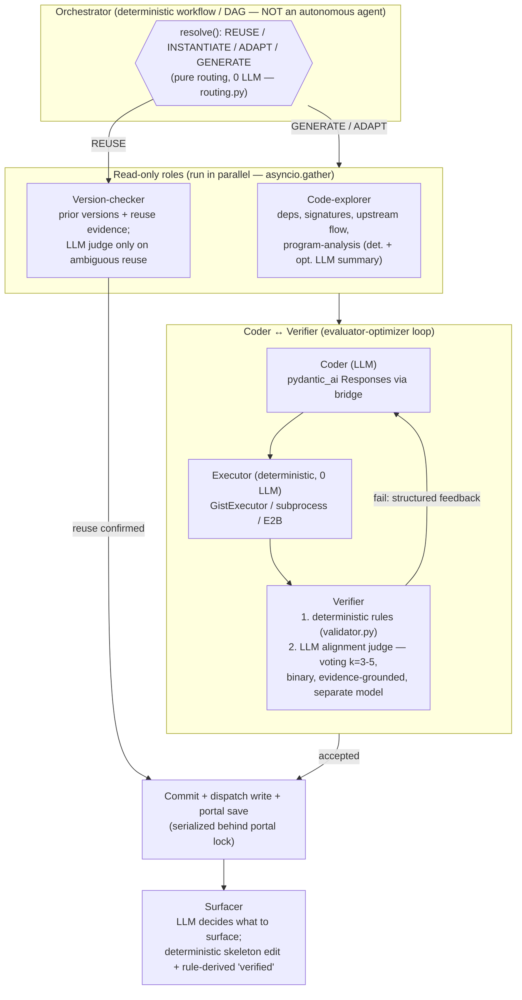
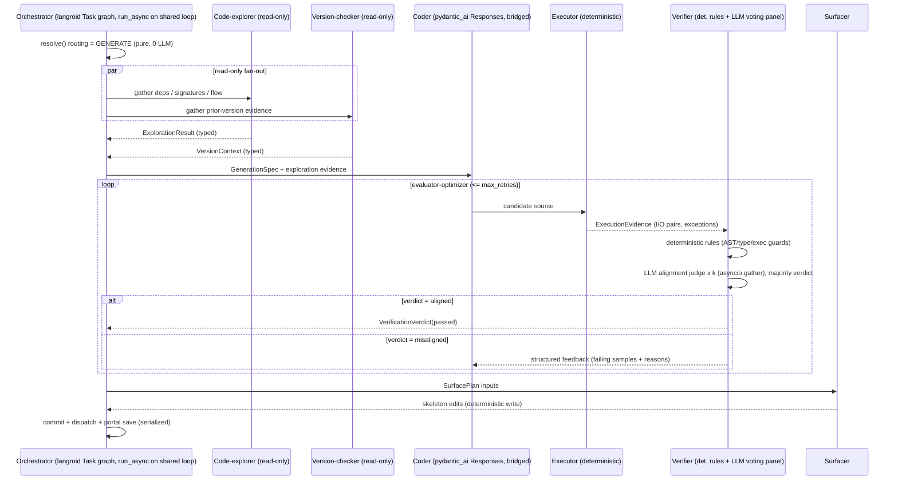

# feat: Multi-Agent Orchestration Pipeline for semipy Generation

## Summary

Replace the procedural, single-shot LLM orchestration inside `execute_slot` with an explicit multi-role pipeline — **orchestrator, code-explorer, version-checker, coder, deterministic executor, verifier, surfacer** — built on **langroid** as the multi-agent substrate, optimizing first for **correctness / alignment quality**.

The design is mapped in full here and delivered in **phases**: de-tangle the spine into typed role boundaries (no behavior change), introduce langroid orchestration as a **dual-stack** layer (langroid on Chat Completions for orchestration/verifier/surfacer; the existing `pydantic_ai` Responses generator kept as the coder behind a bridge), parallelize the read-only roles, then land the correctness upgrades (layered deterministic+LLM verifier with multi-sample voting, evidence-grounded reuse judging) and the multi-role surfacer/UX.

The plan is deliberately **not** an autonomous agent swarm. The multi-agent literature (Anthropic, Cognition, MAST) is consistent that for *code generation* the correctness wins come from a coder↔verifier evaluator-optimizer loop, multi-sample voting, evidence-grounded judging, and parallel *read-only* roles — while parallel coders on shared state and fully autonomous orchestration are net-negative. This plan adopts the former and explicitly rejects the latter.

---

## Problem Frame

Today all orchestration is procedural Python in `semipy/slot_resolver.py` (`_execute_slot_locked`, ~800 lines inside one locked critical section). It inlines every "role" as a sequential function call, and the LLM-backed stages are mostly **one API call at a time**:

- **Generation** (`agents/agent.py:SemiAgent.generate`) — a single `pydantic_ai` agent with one `execute_action_program` tool and a retry loop whose only feedback channel is prose appended to the prompt (`_build_retry_prompt`).
- **Reuse/adapt decision** (`agents/decision.py`) — gist evidence + exactly one LLM judgment, no voting, no adversarial check.
- **Steering / surfacing** (`agents/steering.py:synthesize_steering`) — one LLM call for changed keys.

Consequences the user wants to fix:
1. No separation between *deciding what to do* (orchestrator), *gathering evidence* (explorer/version-checker), *producing code* (coder), *checking it* (verifier), and *surfacing it* (surfacer) — they are tangled in one function and one lock.
2. Single-shot judgments where correctness would benefit from richer, evidence-grounded, multi-sample verification.
3. No parallelism — independent read-only work (dependency lookup, prior-version evidence, runtime profiling) runs serially.
4. The de-facto "agentic pipeline" is one agent loop, not a composition of roles.

**Goal:** a legible, separately-testable role decomposition with an explicit orchestration graph, correctness-first verification, and parallelism for the independent read-only roles — without breaking the public API, the portal/DAG format, the offline test suite, or the determinism boundaries that make REUSE free.

---

## Requirements

Traceable to the user's request:

- **R1** — Replace procedural orchestration with an explicit multi-role pipeline driven by an orchestrator.
- **R2** — Implement the named roles: orchestrator, version-checker (prior-version lookup + reuse/adapt/regenerate), code-explorer (code/dependency lookup), coder, deterministic executor, verifier (deterministic rules **and** LLM alignment vs intent), surfacer (decide what to surface + edit the annotated regions; today's steering synthesizer).
- **R3** — Adopt **langroid** as the multi-agent substrate.
- **R4** — Run independent roles **in parallel** where safe, to reduce wall-clock waiting.
- **R5** — Optimize first for **correctness / alignment quality** (richer verification, evidence-grounded decisions). Latency is secondary.
- **R6** — Preserve existing behavior, the public API surface (`semipy/__init__.py`), the portal/DAG on-disk format, the offline (no-API-key) unit suite, the determinism boundaries (pure routing, deterministic validator, rule-derived `verified`), and the best-effort fallbacks (every LLM step degrades to a deterministic default).
- **R7** — Map the full target architecture now; deliver it in independently-landable phases.

**Success criteria:** all 151 existing unit tests stay green and offline at every phase boundary; a slot's GENERATE path runs through named roles with typed handoffs; the verifier produces an evidence-grounded, multi-sample alignment verdict; read-only roles run concurrently; REUSE remains 0-LLM; and the public API / portal format are unchanged.

---

## High-Level Technical Design

### Role topology and determinism boundary



### One GENERATE call through the pipeline



### Role → implementation map

| Role | LLM? | langroid construct | Backed by today |
|------|------|--------------------|-----------------|
| Orchestrator | No (thin router only) | `Task` graph, code-driven control flow, typed result tools | `_execute_slot_locked` spine |
| Code-explorer | Det. + optional LLM summary | read-only `Task`, run in parallel | `program_analysis.py`, profiler, reactivity flow |
| Version-checker | Mostly det.; LLM judge at margin | read-only `Task` | `routing.py`/`resolver.py` + `decision.py` |
| Coder | Yes | bridged: langroid tool handler → `pydantic_ai` Responses agent | `agent.py`/`generator.py` |
| Executor | **No** | deterministic tool handler (`agent_response`) | `executor.py` (GistExecutor) |
| Verifier | Det. rules + LLM voting | `Task` + `run_batch`/`gather` voting, `ResultTool` verdict | `validator.py` + `decision.py` |
| Surfacer | LLM for "what"; det. for edit | `Task`; deterministic write stays in code | `steering.py` + `skeleton_writer.py` |

---

## Key Technical Decisions

### KTD1 — Dual-stack: langroid (Chat Completions) orchestrates; coder stays on `pydantic_ai` (Responses)

langroid's LLM path is **OpenAI Chat Completions**, not the **Responses API** the generator depends on (`generator.py:31-36` sets `openai_send_reasoning_ids=True`, `openai_reasoning_summary='auto'`). Rather than migrate generation off Responses (losing reasoning-id continuity and the existing, tuned generation behavior), run a **dual-stack**: langroid owns a Chat-Completions client for orchestration, verifier, and surfacer roles; the **coder** remains the existing `pydantic_ai` Responses agent, invoked from inside a langroid **tool handler** (a deterministic bridge that calls `SemiAgent.generate_async`). Two OpenAI clients coexist in one process (confirmed safe — langroid instantiates its own client, no global monkeypatch). This is the lowest-risk path that honors the langroid adoption while preserving generation quality. *(see Alternatives for the no-langroid fallback if dependency cost proves prohibitive.)*

### KTD2 — Orchestrator is a deterministic workflow, not an autonomous agent

Control flow is code-driven (a typed DAG of role calls), not model-directed. langroid `Task`s compose the roles and carry typed results, but the orchestrator does not let an LLM decide the next step. Evidence: Cognition ("Don't Build Multi-Agents" — single-threaded linear agents for code; conflicting implicit decisions wreck parallel coders) and MAST (≈44% of multi-agent failures are system-design, ≈32% inter-agent misalignment). The portal/DAG remains the **external state**; the orchestrator routes by reading IDs/summaries, never by carrying every prior version's code in-prompt.

### KTD3 — Verifier: deterministic-first, LLM-alignment-last, with multi-sample voting

Order is fixed: (1) AST/type/exec guards (`validator.py`, unchanged, deterministic) → (2) execute candidate, capture real I/O → (3) LLM alignment judge that grades *observed behavior* against the NL spec. The judge is **binary** (aligned / not), **evidence-grounded** (executed I/O pairs are the "reference"), uses **chain-of-thought before verdict**, runs **k=3-5 samples with majority vote** (correctness-first; GenRM/self-consistency evidence), and uses a **different model/prompt-role from the coder** to counter self-enhancement bias. An optional adversarial "try to refute" sample is a third signal, not the sole gate.

### KTD4 — Parallelize read-only roles; serialize all writers; embed via `run_async`

Code-explorer and version-checker evidence-gathering are read-only and run concurrently via `asyncio.gather` over `task.run_async(...)` on the **existing shared background loop** (`agent.py:_ensure_async_loop`). Verifier voting fans out the same way. **Do not** use langroid's `run_batch_*` on the host loop — those call `asyncio.run()` and own a loop (would raise "loop already running"); if batch plumbing is wanted, dispatch it via `loop.run_in_executor`. All state mutation (coder writing dispatch, surfacer editing `#<`/`#>`, portal read-modify-write) stays **serial** behind the existing per-portal and per-slot single-flight locks. "Serialize the writers, parallelize the readers."

### KTD5 — Typed Pydantic artifacts for every role handoff

Roles exchange typed objects, not freeform chat: `ExplorationResult`, `VersionContext`/`ReuseVerdict`, `GenerationResult`, `ExecutionEvidence`, `VerificationVerdict`, `SurfacePlan`. In langroid these ride on `ResultTool`/`FinalResultTool` subclasses or `task.run(return_type=...)`. This makes role boundaries unit-testable in isolation and keeps the orchestrator's routing deterministic.

### KTD6 — Every LLM role preserves a deterministic best-effort fallback

Each LLM-backed role must degrade to today's deterministic default on missing API key or any exception: version-checker → REUSE; verifier alignment → pass-through to existing guards; surfacer → heuristic/carry-forward; coder bridge → existing retry behavior. This is what keeps the 151-test unit suite **offline**. Any new role that calls an LLM must have an offline-default path exercised by tests.

### KTD7 — Narrow the portal lock; move the generated-fn call out of it

Today `_portal_lock` is held across the entire `_execute_slot_locked` body, *including the generated function call*. To allow role overlap and avoid holding a lock across user-code execution, narrow the lock to the portal read-modify-write (and dispatch write), and move `_call_generated_fn` outside it. This must preserve reactivity/flow semantics (producer-flow attach, pull-based staleness) — covered by parity tests.

---

## Output Structure

New/restructured layout under `semipy/` (existing modules in plain text, new in **bold**):

```
semipy/
  slot_resolver.py            # spine slims to call orchestrator
  orchestration/              # NEW package
    __init__.py
    artifacts.py              # NEW typed handoff models (KTD5)
    orchestrator.py           # NEW workflow/DAG driver (KTD2)
    roles/
      __init__.py
      explorer.py             # NEW code-explorer (read-only)
      version_checker.py      # NEW wraps routing + reuse judge
      coder.py                # NEW langroid->pydantic_ai bridge (KTD1)
      executor_role.py        # NEW deterministic executor wrapper
      verifier.py             # NEW layered verifier + voting (KTD3)
      surfacer.py             # NEW what-to-surface decision
    langroid_runtime.py       # NEW langroid client/config + run_async embedding (KTD4)
  agents/                     # existing roles' implementations are reused/bridged
    agent.py  generator.py  decision.py  validator.py  steering.py  skeleton_writer.py  executor.py  config.py
docs/
  orchestration.md            # NEW subsystem doc
```

The per-unit `**Files:**` lists remain authoritative; this tree is the intended shape, not a constraint.

---

## Implementation Units

### Phase A — De-tangle into typed role boundaries (no behavior change)

#### U1. Add langroid + centralize per-role model config

**Goal:** Land the dependency and a single place to construct per-role LLM clients, without wiring any role yet.
**Requirements:** R3, R6.
**Dependencies:** none.
**Files:** `pyproject.toml`, `uv.lock`, `semipy/agents/config.py`, `semipy/orchestration/langroid_runtime.py` (new), `tests/unit/test_orchestration_config.py` (new).
**Approach:** Add `langroid` (current `0.65.0`); raise the `openai` floor to `>=1.61.1` (langroid's floor) and the stale `pydantic-ai>=0.0.54` to the installed `>=1.63`. Run `uv lock` and inspect the resolved tree for `openai`/`pydantic` shifts. In `config.py`, add per-role model fields (e.g. `orchestrator_model`, `verifier_model`, `verifier_vote_samples=3`) defaulting to `openai_model`; centralize the three currently-hardcoded `OpenAIResponsesModel` constructions (`generator.py:31`, `decision.py:325`, `steering.py:488`) behind config-driven factories. `langroid_runtime.py` exposes a lazy `OpenAIGPTConfig`/client factory and an `embed_run(task, msg)` helper that calls `task.run_async` on the shared background loop.
**Patterns to follow:** `config.py` dataclass + `configure(**kwargs)`; the existing shared-loop bridge in `agent.py:_run_async`.
**Test scenarios:**
- `verifier_vote_samples` and per-role model fields default to `openai_model` when unset, and `configure(...)` overrides them. (happy path)
- `langroid_runtime` client factory raises a clear error when no API key is configured, and returns a config object (no network) when a key is present. (error path)
- `embed_run` schedules a coroutine on the existing shared loop and returns its result without creating a second loop. (integration; assert loop identity)
- Importing `semipy` still succeeds and the public API surface in `__init__.py` is unchanged. (regression)

#### U2. Define typed handoff artifacts and extract deterministic role callables

**Goal:** Formalize what flows between roles and carve the already-deterministic logic into clean, independently-callable functions.
**Requirements:** R1, R5, R6.
**Dependencies:** U1.
**Files:** `semipy/orchestration/artifacts.py` (new), `semipy/orchestration/roles/version_checker.py` (new, thin), `semipy/orchestration/roles/executor_role.py` (new, thin), `tests/unit/test_orchestration_artifacts.py` (new).
**Approach:** Define Pydantic models: `ExplorationResult`, `VersionContext`, `ReuseVerdict`, `GenerationResult`, `ExecutionEvidence`, `VerificationVerdict`, `SurfacePlan` (KTD5). Wrap the existing pure functions as role callables that produce these artifacts: `version_checker` wraps `resolve()` (`resolver.py`) + the gist evidence builder (`decision.py`); `executor_role` wraps `GistExecutor`. No LLM calls move yet; these are deterministic adapters returning typed artifacts.
**Patterns to follow:** existing `ResolutionResult`/`ValidationResult` dataclasses; `type_adapter_for(T)` for any validation.
**Test scenarios:**
- Each artifact round-trips through pydantic validation with representative values. (happy path)
- `version_checker` callable returns a `VersionContext` whose decision matches `RoutingPolicy.decide` for REUSE, ADAPT, GENERATE, and INSTANTIATE fixtures. (integration; covers R2)
- `executor_role` returns `ExecutionEvidence` with captured exceptions when the candidate raises, and I/O pairs on success. (edge + error)
- Artifacts are JSON-serializable (portal/persistence safety). (edge)

#### U3. Refactor the spine into an explicit orchestrator sequence (pure refactor)

**Goal:** Replace the inline `_execute_slot_locked` tangle with an `Orchestrator` that calls role callables in sequence, byte-for-byte behavior preserved; narrow the portal lock.
**Requirements:** R1, R6, R7, KTD7.
**Dependencies:** U2.
**Files:** `semipy/orchestration/orchestrator.py` (new), `semipy/slot_resolver.py` (slim `_execute_slot_locked` to delegate), `tests/unit/test_orchestrator_parity.py` (new), `tests/unit/test_portal_concurrency.py` (extend).
**Approach:** Move the stage sequence (PDF materialize → project/lock → portal load/migrate → ensure slot/observations → dep-edges → spec-change/staleness → interpreted branch → resolve → INSTANTIATE/REUSE/GENERATE → gates → commit → steering → skeleton → sketch/contract schedule → call fn) into `Orchestrator.run(...)` as explicit, named steps. **No langroid yet** — this is a structural extraction so every step is a testable method. Narrow `_portal_lock` to cover portal read-modify-write + dispatch write only; move `_call_generated_fn` outside the lock (KTD7), preserving producer-flow attach and pull-based staleness ordering.
**Execution note:** Characterization-first — capture current behavior in `test_orchestrator_parity.py` against the existing spine before extracting, then refactor until parity holds.
**Patterns to follow:** keep all existing `try/except → deterministic default` fallbacks verbatim; preserve outer→inner lock order (single-flight outside portal lock).
**Test scenarios:**
- All 151 existing unit tests pass unchanged. (regression — the bar for this unit)
- Reactivity wiring tests (`test_reactivity_wiring.py`) pass with the fn-call moved out of the lock: producer flow still attaches, `stale_against_inputs`/`record_consumed` still settle mutual deps. (integration; covers R6)
- Portal concurrency: 24-thread lost-update test still passes with the narrowed lock; no portal write races. (integration)
- A slot that raises inside the generated fn no longer holds the portal lock during the raise. (edge; assert lock released before fn call)
- Interpreted-mode slots still branch before `resolve()`. (integration)

---

### Phase B — langroid orchestration substrate

#### U4. Wrap the orchestrator as langroid Tasks with the coder bridge

**Goal:** Make the orchestrator drive langroid `Task`s with typed result tools, and run the coder as a langroid tool handler that calls the existing `pydantic_ai` Responses agent (dual-stack).
**Requirements:** R3, R6, KTD1, KTD2, KTD5.
**Dependencies:** U3.
**Files:** `semipy/orchestration/orchestrator.py`, `semipy/orchestration/roles/coder.py` (new), `semipy/orchestration/langroid_runtime.py`, `tests/unit/test_coder_bridge.py` (new).
**Approach:** Each role becomes a langroid `Task` (`interactive=False`, `recognize_string_signals=False`, tool-based termination) returning a typed artifact via `ResultTool`/`return_type`. The **coder** `Task` has a deterministic tool handler that invokes `SemiAgent.generate_async` (Responses, unchanged) and returns a `GenerationResult` — langroid orchestrates, generation stays on Responses (KTD1). Control flow stays code-driven (KTD2): the orchestrator calls `embed_run` per role and branches in Python. Behavior parity with U3 maintained.
**Patterns to follow:** langroid `AgentDoneTool`/`ResultTool` for typed handoff; `embed_run` (U1) for loop embedding; offline fallback (KTD6) when no API key — coder bridge falls back to the direct `SemiAgent.generate` path.
**Test scenarios:**
- The coder bridge, with a stubbed `SemiAgent.generate_async`, returns a `GenerationResult` carrying the generated source. (happy path; no network)
- With no API key, the orchestrator path still runs deterministic stages and the coder bridge degrades to the existing behavior; suite stays offline. (error path; covers R6/KTD6)
- A langroid `Task` for a deterministic role (executor) completes in a single round with no LLM call. (integration; assert 0 model calls)
- Typed artifact survives the langroid `ResultTool` round-trip unchanged. (integration; covers KTD5)
- Parity: GENERATE output for a fixture spec matches U3. (regression)

#### U5. Code-explorer + version-checker as parallel read-only roles

**Goal:** Run dependency/code exploration and prior-version evidence-gathering concurrently before the coder, feeding exploration evidence into the generation prompt.
**Requirements:** R2, R4, R5, KTD4.
**Dependencies:** U4.
**Files:** `semipy/orchestration/roles/explorer.py` (new), `semipy/orchestration/roles/version_checker.py`, `semipy/orchestration/orchestrator.py`, `semipy/agents/agent.py` (`_build_user_prompt` accepts exploration evidence), `tests/unit/test_parallel_roles.py` (new).
**Approach:** `explorer` gathers deterministic facts (import graph, callee signatures via `program_analysis.py`, upstream `DataFlow` requirements, runtime profile) and an optional LLM relevance summary. The orchestrator runs `explorer` and `version_checker` evidence-gathering via `asyncio.gather` over `run_async` on the shared loop (KTD4 — not `run_batch_*`). Both are read-only; no shared-state mutation. Exploration evidence is threaded into `_build_user_prompt`.
**Patterns to follow:** `asyncio.gather` on the existing shared loop; read-only roles never take the portal lock for writes.
**Test scenarios:**
- `explorer` returns an `ExplorationResult` with dependency signatures and upstream requirements for a fixture slot, deterministically (no API key). (happy path; covers R2)
- Two read-only roles run concurrently and both results are gathered; total wall-clock < sum of individual sleeps (use instrumented stubs). (integration; covers R4)
- A failure in one read-only role degrades to an empty/typed-default artifact without aborting the other or the pipeline. (error path; covers R6)
- Exploration evidence appears in the built generation prompt. (integration)
- No portal write occurs from read-only roles (assert lock not acquired for write). (edge; covers KTD4)

---

### Phase C — Correctness upgrades (the payoff)

#### U6. Layered verifier with multi-sample alignment voting + evaluator-optimizer loop

**Goal:** Replace the single-shot validate→prose-retry with a verifier that runs deterministic rules then an evidence-grounded, multi-sample LLM alignment judge, feeding structured feedback back to the coder.
**Requirements:** R5, KTD3, KTD6.
**Dependencies:** U4 (U5 optional).
**Files:** `semipy/orchestration/roles/verifier.py` (new), `semipy/agents/validator.py` (reused), `semipy/orchestration/orchestrator.py` (coder↔verifier loop), `tests/unit/test_verifier.py` (new).
**Approach:** Verifier step 1 = existing deterministic guards (`validate`/`verify_runtime_execution`, unchanged). Step 2 = run candidate via executor to get real I/O, then an LLM alignment judge: binary verdict, CoT-before-verdict, executed I/O as the grounded reference, **k=`verifier_vote_samples` samples via `asyncio.gather`, majority vote**, separate model/prompt-role from the coder (KTD3). On misalignment, return a structured `VerificationVerdict` with failing samples + reasons; the orchestrator's evaluator-optimizer loop feeds that (not raw prose) back to the coder, replacing `_build_retry_prompt`'s prose-only channel. Optional adversarial "refute" sample as a third signal.
**Patterns to follow:** `decision.py:SemanticDecision` for the judge agent shape; majority-vote aggregation; deterministic fallback (KTD6) — if no API key, verifier = deterministic guards only (current behavior).
**Test scenarios:**
- Deterministic guards run first and a candidate failing AST/type/exec is rejected before any LLM call. (happy path; covers ordering in KTD3)
- Majority voting: 3 stubbed judge verdicts [aligned, aligned, misaligned] → overall `aligned`; [misaligned, misaligned, aligned] → `misaligned`. (happy path; covers voting)
- The alignment judge prompt includes the executed I/O pairs (evidence grounding); a judge with no evidence is never invoked. (integration; covers KTD3)
- Misalignment produces structured feedback with the specific failing input/output, and the coder loop re-runs with it. (integration; evaluator-optimizer)
- No API key → verifier returns the deterministic guard result only, no error, suite offline. (error path; covers KTD6)
- Identity-passthrough / empty-output guards still force ADAPT via `failure_kind`. (edge; regression)
- Position-bias mitigation: when the judge compares old-vs-new, both orderings are evaluated. (edge)

#### U7. Evidence-grounded reuse judging in the version-checker

**Goal:** Upgrade the reuse/adapt judgment to a binary, evidence-cited, voting verdict that biases toward verification, building on `decision.py`.
**Requirements:** R2, R5, KTD3.
**Dependencies:** U5, U6.
**Files:** `semipy/orchestration/roles/version_checker.py`, `semipy/agents/decision.py` (reused/extended), `tests/unit/test_reuse_judge.py` (new).
**Approach:** Keep the deterministic fast path (`spec_equivalence_key` match → REUSE, 0 LLM). For the ambiguous middle, run the cached impl on the new inputs (executor) and have the judge grade observed I/O with a **binary, evidence-cited** verdict (must point at the supporting sample), optional voting, and a **default toward ADAPT/regenerate when evidence is thin** (MAST under-verification is the modal failure). Preserve the rate-limiter/convergence cap (`semantic_verify_max_adapts`).
**Patterns to follow:** existing `_should_semantic_check` gating; `evaluate_reuse_semantics` evidence build; fallback to REUSE only when a key is absent (KTD6) — but bias to ADAPT when evidence exists but is ambiguous.
**Test scenarios:**
- Equivalence-key match short-circuits to REUSE with 0 LLM calls. (happy path; covers 0-LLM REUSE)
- Ambiguous reuse with executed I/O evidence yields a binary verdict citing a specific sample. (integration; covers KTD3)
- Thin/absent evidence biases to ADAPT, not optimistic REUSE. (edge; covers under-verification)
- Convergence cap still halts repeated ADAPT churn at `semantic_verify_max_adapts`. (edge; regression)
- No API key → defaults to REUSE (current behavior). (error path; covers KTD6)

---

### Phase D — Surfacer and multi-role UX

#### U8. Surfacer role: LLM decides what to surface; deterministic edit mechanics

**Goal:** Recast the steering synthesizer as a surfacer role that decides *what* to surface, while the deterministic skeleton write and rule-derived `verified` are preserved.
**Requirements:** R2, R6.
**Dependencies:** U4.
**Files:** `semipy/orchestration/roles/surfacer.py` (new), `semipy/agents/steering.py` (reused), `semipy/agents/skeleton_writer.py` (unchanged), `tests/unit/test_surfacer.py` (new).
**Approach:** Wrap `synthesize_steering` as the surfacer's "what to surface" decision (changed-key synthesis), returning a `SurfacePlan`; the orchestrator then calls the **unchanged deterministic** `surface_skeleton` to write `#<` lines. `verified` stays `_derive_verified` (never LLM), `yields` stays AST-grounded. The surfacer may additionally decide which zones to surface, but never synthesizes `verified`.
**Patterns to follow:** `steering.py` carry-forward + `_should_skip_key`; deterministic write in `skeleton_writer.py`; heuristic fallback (KTD6).
**Test scenarios:**
- Surfacer returns a `SurfacePlan`; the deterministic writer produces the same `#<` placement as today for a fixture slot. (happy path; regression vs `test_steering_placement.py`)
- `verified` is rule-derived and never sent to the model. (edge; covers R6 determinism)
- No API key → heuristic intent/yields fallback, write still happens. (error path; covers KTD6)
- User-promoted `#<`→`#>` keys are still omitted. (edge; regression)

#### U9. Concurrent-role streaming UX

**Goal:** Surface multiple concurrent roles in the console/Jupyter view instead of the single linear model stream.
**Requirements:** R4 (supporting), R6.
**Dependencies:** U5, U6.
**Files:** `semipy/agents/console_view.py`, `semipy/agents/console_io.py`, `tests/unit/test_console_multiplex.py` (new).
**Approach:** Generalize the single `PhaseState` strip + peek deque into a small set of **role lanes** (explorer / version-checker / coder / verifier / surfacer), each with its own phase + tail, rendered in one Rich `Live` region (terminal) or throttled redraw (Jupyter). Piped/CI still falls back to plain transient lines. No behavior change when only one role is active.
**Patterns to follow:** `GenerationStreamView`/`JupyterStreamPeek` structure; `effective_stream_display_mode`.
**Test scenarios:**
- With one active role the rendered output matches today's single-stream layout. (regression)
- Two concurrent roles render two lanes without interleaving corruption (assert on the rendered model, not the terminal). (happy path; covers R4 UX)
- Piped/non-terminal output falls back to plain lines. (edge)
- `verbose=False` silences all lanes. (edge)

---

### Phase E — Hardening and docs

#### U10. Role-boundary tests, parity suite, and documentation

**Goal:** Lock in the determinism boundaries with offline tests and document the new subsystem.
**Requirements:** R6, R7.
**Dependencies:** U6, U7, U8, U9.
**Files:** `tests/unit/test_role_boundaries.py` (new), `tests/unit/test_routing.py` (new), `tests/unit/test_validator.py` (new), `docs/orchestration.md` (new), `docs/architecture.md` (update), `CLAUDE.md` (update Subsystems + Architecture-at-a-glance).
**Approach:** Add the missing deterministic-role tests the codebase lacks today (no `test_routing.py`/`test_validator.py` exist). Add an end-to-end orchestration parity harness driven by stubbed roles (no API key) asserting the role sequence and typed-handoff contracts. Document the role topology, dual-stack rationale (KTD1), determinism boundary, and parallelism model in `docs/orchestration.md`; update `docs/architecture.md` and the `CLAUDE.md` Subsystems section.
**Test scenarios:**
- `test_routing.py` exercises all RoutingPolicy precedence cases deterministically. (happy path; fills a real coverage gap)
- `test_validator.py` exercises the data-agnostic guards (empty-output, identity passthrough) and type checks. (happy path)
- Role-boundary test asserts each LLM role has an offline default exercised without a key. (integration; covers R6)
- Orchestration parity harness asserts the GENERATE role sequence and the typed artifacts passed between roles. (integration; covers R1/R7)
- `Test expectation: none -- docs-only` for the `docs/` and `CLAUDE.md` changes.

---

## Scope Boundaries

**In scope:** the orchestration spine, the seven roles, langroid adoption (dual-stack), parallel read-only roles, correctness-first verifier + reuse judging, the surfacer, concurrent-role UX, and the determinism/offline-test guarantees.

**Out of scope (wrapped, not rewritten):** the effects subsystem (`semipy/effects/`), behavioral contract (`semipy/contract/`), sketch library (`semipy/library/`), and interpreted mode (`semipy/interpreted.py`) — each is invoked by the orchestrator exactly as today; their internals don't change. The public API (`semipy/__init__.py`), the portal/DAG on-disk format, and the VS Code extension contract are unchanged.

### Deferred to Follow-Up Work
- Migrating the **coder** off `pydantic_ai` Responses onto langroid Chat Completions (only if the dual-stack proves to be a maintenance burden — revisit after Phase C).
- A langroid-native batch path (`run_batch_*` in an executor thread) for verifier voting, if `asyncio.gather` proves insufficient at scale.
- Recording the langroid-vs-pydantic_ai tooling decision as a `docs/solutions/` learning (no learnings store exists yet).

---

## Risks & Dependencies

- **langroid dependency footprint (high).** Even the slim core pulls `onnxruntime`, `grpcio`, `qdrant-client`, `redis`, `pandas`, `nltk`, `tiktoken`, `fastmcp`, and provider SDKs — a much wider, partly-compiled tree than `pydantic_ai + openai`. *Mitigation:* gate it behind U1's lockfile inspection; if the tree is unacceptable for a distributed library, fall back to the **thin-custom-orchestrator** alternative (below) — the role decomposition (U2/U3) is langroid-independent, so Phase A is safe regardless.
- **Responses vs Chat Completions divergence (KTD1).** Two OpenAI clients/configs to keep aligned (model id, reasoning effort, key). *Mitigation:* centralized per-role config (U1); document in `docs/orchestration.md`.
- **Token cost (~15× for naive multi-agent; voting multiplies verifier calls).** *Mitigation:* correctness-first explicitly accepts cost; REUSE stays 0-LLM; voting only on the alignment verdict and only on GENERATE/ambiguous-reuse; `verifier_vote_samples` configurable.
- **Concurrency regression from narrowing the portal lock (KTD7).** Moving the fn-call out of the lock could perturb reactivity/flow ordering. *Mitigation:* characterization-first parity tests (U3) before refactor.
- **Multi-agent coordination failure modes (MAST/Cognition).** *Mitigation:* DAG-not-swarm orchestrator (KTD2), full context to the single coder, serialized writers, parallelize only read-only roles.
- **Streaming UX rework.** Single-stream assumptions are baked into `console_view.py`. *Mitigation:* isolate to U9; one-role path unchanged.

**External dependency:** `langroid==0.65.0`, `openai>=1.61.1`, Python 3.11+ (satisfied).

---

## Alternative Approaches Considered

- **Thin layer over `pydantic_ai` (no new framework).** Build the orchestrator/roles directly over the `pydantic_ai` Agents already in use. *Pros:* no heavy deps, reuses streaming/async, keeps Responses everywhere. *Cons:* no built-in delegation/typed-result-tool primitives. **Rejected** per the chosen direction (langroid), but retained as the **fallback** if U1's dependency audit fails — Phase A is framework-agnostic by design, so the switch is cheap before Phase B.
- **Custom lightweight orchestrator.** A hand-written typed DAG. *Pros:* full control over parallelism/determinism. *Cons:* more code to own. Folded into the fallback above.
- **Full migration to langroid Chat Completions (drop Responses).** *Rejected:* loses reasoning-id continuity and the tuned generation behavior; higher risk for no correctness gain.
- **Autonomous multi-agent swarm (model-directed control flow).** *Rejected:* the evidence (Cognition, MAST) shows this is net-negative for code — conflicting implicit decisions and coordination failures dominate.

---

## Sources & Research

- Current orchestration map (file:symbol level): `semipy/slot_resolver.py` (`_execute_slot_locked`, `_portal_lock`, `_slot_singleflight_lock`), `semipy/agents/agent.py` (`SemiAgent.generate`, shared loop), `semipy/agents/generator.py` (single-tool Responses agent), `semipy/agents/decision.py` (semantic judge), `semipy/routing.py`/`semipy/resolver.py` (pure routing), `semipy/agents/validator.py` (deterministic checks), `semipy/agents/steering.py` + `skeleton_writer.py` (surfacer), `semipy/agents/config.py`. Installed: `pydantic_ai 1.63`, `openai 2.18`, `pydantic 2.12.5` (pyproject floor `pydantic-ai>=0.0.54` is stale).
- langroid `0.65.0`: Chat-Completions-only LLM path (no Responses API); `Task`/`ChatAgent`, sub-task delegation, `ResultTool`/`FinalResultTool`/`AgentDoneTool` typed handoffs, `run_batch_*` (owns a loop via `asyncio.run`), `run_async` (uses caller's loop), `OpenAIGPTConfig` with `reasoning_effort`. Heavy transitive deps. Docs: langroid.github.io (task, batch, structured-output, orchestration-tools references), PyPI metadata.
- Multi-agent correctness best practices: Anthropic *Building Effective Agents* / *Multi-Agent Research System* (workflows-vs-agents, evaluator-optimizer, ~15× tokens, parallelize read-only); Cognition *Don't Build Multi-Agents* (single-threaded for code, share full traces); MAST arXiv:2503.13657 (system-design ~44% / misalignment ~32% of failures, under-verification modal); GenRM arXiv:2408.15240 (voting); Huang et al. arXiv:2310.01798 (intrinsic self-correction degrades); Zheng et al. arXiv:2306.05685 (judge biases); Eugene Yan LLM-evaluators (binary verdict, one dimension/prompt, evidence grounding).
- No `docs/solutions/` learnings store exists; the de-facto authority is `docs/architecture.md` + `CLAUDE.md`.
