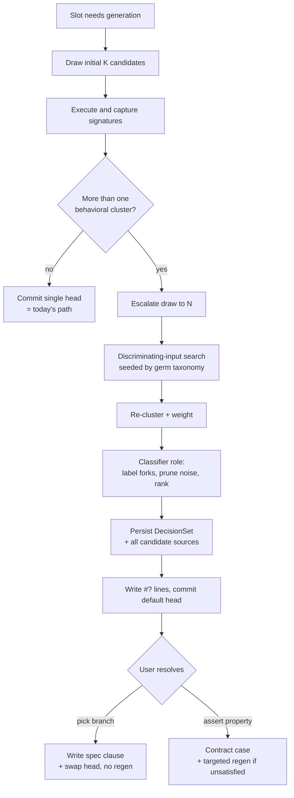

# feat: Surface the model's silent decisions as navigable forks

## Summary

Build a `semipy/decisions/` subsystem that, when a slot is genuinely
underspecified, draws several candidate implementations, runs them to find where
their behavior diverges, labels each divergence as a user-legible decision, and
surfaces it inline as a `#?` fork the user resolves by picking a branch or
asserting a property. The work composes on the existing executor, effects, and
contract machinery; net-new code is the N-way clustering, discriminating-input
search, the decision-classifier role, the `DecisionSet` artifact, and the `#?`
skeleton writer.

---

## Problem Frame

semipy generates exactly one candidate per slot and surfaces only the mechanism
that candidate used (`#<` `by`/`unless`), after validation. The alternatives the
model weighed and the choices it made silently are never visible. When intent is
underspecified — "average cover per site; some covers are null" — the model must
guess (skip nulls vs count them as zero; omit a never-surveyed site vs emit NaN),
and the guess only becomes visible later, as a bug in real output.

The fix is to capture the candidate space automatically, ground each fork in
observed behavioral divergence, and present it as a decision the user can steer
at authoring time. The hard part is altitude: a raw AST diff is unreadable, and
precise static methods (taint, symbolic execution) break on the pandas/numpy
code semipy targets. The plan's answer is to run candidates and cluster them by
observed output (deterministic, domain-agnostic), then have an LLM name the real
forks in the user's language — so the surface is legible without being invented.

---

## Requirements

Carried from origin (`see origin: docs/brainstorms/2026-06-16-surface-silent-decisions-requirements.md`).

### Candidate space and divergence
- R1. Generation draws multiple candidates under an adaptive policy: a small
  initial draw, escalating only when the initial draw diverges.
- R2. Candidates are executed and clustered by observed output divergence; each
  cluster is a branch weighted by its share of candidates.
- R3. When candidates agree, the slot resolves exactly as today — single
  committed implementation, no forks, no added persistence.
- R4. Divergence with no observable behavioral difference (float jitter, dict key
  ordering, untaken tie-breaks) is pruned and never surfaced.

### Decision model and labeling
- R5. Each decision is `(ambiguity germ, set of fates, optional guard,
  distribution)`, indexed by an ambiguity source in the input.
- R6. A grounded LLM classifier names each real fork in user language from forks
  execution demonstrated; with no API key, the system falls back to a
  deterministic unlabeled output-cluster view rather than failing.
- R7. The system searches for discriminating inputs (seeded by the germ taxonomy)
  to expose forks the available inputs did not exercise.
- R8. Decisions are ranked by consequence (output spread) so high-stakes forks
  surface first.

### Cross-domain divergence observation
- R9. Pure/deterministic slots: divergence captured from rich return-value
  signatures (type, structured value, shape, emptiness).
- R10. Effectful slots (DB, server/client, webscraping): divergence captured from
  each candidate's reified `EffectScript`, diffed by intended effects, without
  real mutations.
- R11. Nondeterministic/expensive slots (model training, scraping, visualization):
  divergence observed on decision-bearing structure under controlled determinism
  and an execution-cost guard; where a domain has no comparable signal, the system
  says so rather than surfacing noise.

### Surface and steering
- R12. Open decisions are inline `#?` lines, parallel to `#>`/`#<`, stripped
  before lowering so they never perturb `slot_id`, ordinals, or line numbers.
- R13. A user resolves a fork by picking a branch; the fate is written into the
  spec surface, the matching candidate becomes the committed head, and the fork
  closes without regenerating.
- R14. A user resolves a fork by asserting an NL property when no branch fits; the
  property becomes a contract case and triggers a targeted regeneration when no
  current candidate satisfies it.
- R15. (Deferred — see Scope Boundaries) Counterfactual interrogation of the
  neighborhood.
- R16. (Deferred — see Scope Boundaries) Query/NL DSL over the decision set.

### Persistence and rendering contract
- R17. Each resolution persists a content-addressed `DecisionSet` in the portal,
  referencing actual candidate sources including losing candidates, so a later
  pick swaps the head without regenerating.
- R18. The `DecisionSet` schema is documented as the VS Code render contract and
  kept in sync with the extension's type definitions.

---

## Key Technical Decisions

- KTD1. **Grounding is observed output divergence, not static analysis.** Run
  candidates and cluster by behavior. Survives real dataframe/numeric code where
  taint and symbolic execution lose precision. Cost (only sees divergence an input
  exercises) is mitigated by the discriminating-input search (U5).
- KTD2. **Execution finds and weights forks; the LLM only names them.** The
  clustering pass (deterministic) produces branches and weights; the classifier
  (U6) labels only forks execution demonstrated. The classifier can never
  introduce a decision the candidates did not exhibit — this is the trust model.
- KTD3. **A decision is a feature-fate node indexed by an ambiguity germ**, not a
  code statement. The reusable, general-purpose surface is the germ taxonomy
  (null/missing, empty, tie, boundary, ordering, coercion, precision,
  unit/tz/encoding, grouping-key absence).
- KTD4. **Vocabulary: "decision" / "fork" / "branch" / "germ" — never "effect."**
  `semipy/effects/` owns "effect" for real-world mutations. The new subsystem
  lives under `semipy/decisions/` and must not reuse effect vocabulary for
  feature-fates, or the two collide.
- KTD5. **Extend existing capture, do not build a new engine.** Reuse
  `GistExecutor`, the `contract/runner.py` batch-gist capture, `effects/shadow.py`
  shadow execution, `effects/diff.py`, and `contract/change.py` output comparison.
  Net-new: N-way clustering, discriminating-input search, classifier role,
  `DecisionSet`, `#?` writer.
- KTD6. **Two execution modes cover the use-case domains.** Return-value capture
  for pure slots (parsing, in-memory transforms); reified `EffectScript` diff for
  effectful slots (DB, server/client, webscraping). Nondeterministic/expensive
  slots (model training, visualization) get seeding + cost-guard + a
  decision-structure comparison with explicit honest limits (U11).
- KTD7. **Adaptive trigger preserves today's fast paths.** Slots whose candidates
  agree must hit the existing single-candidate commit and REUSE-after-cache paths
  unchanged; the divergence machinery only engages when the initial draw splits.
- KTD8. **`#?` lines are stripped before lowering** via the same mechanism `#<`
  uses (`strip_skeleton_lines`), so adding, editing, or removing a `#?` line never
  changes `slot_id` or slot ordinals.

---

## High-Level Technical Design

### Adaptive resolve pipeline

The pipeline inserts between generation and commit. The single-cluster path is
today's behavior; the multi-cluster path is the new subsystem.



Execution capture (step C) routes by slot kind: pure slots use the batch-gist
return-value capture; effectful slots (declare `fx`) use shadow execution and
diff `EffectScript`s; nondeterministic/expensive slots run seeded under the
cost-guard (U11).

### DecisionSet shape (the render contract)

Directional, not the final dataclass definition.

```
DecisionSet (per slot resolution, content-addressed in portal)
  decisions: [
    Decision {
      germ:        "null" | "empty" | "tie" | "missing-key" | ...
      axis_label:  "null reading"            # LLM-named (R6); null without API key
      branches: [
        Branch { fate_label, candidate_ids[], weight,
                 example_in, example_out }    # minimized discriminating example
      ]
      guard:        optional predicate string  # best-effort
      consequence:  spread metric / rank        # R8
      status:       open | resolved
      resolution:   null
                  | { via: "pick",   branch }
                  | { via: "assert", property, contract_case_id }
    }
  ]
  candidates: { candidate_id -> source }       # includes losers (R17)
```

---

## Implementation Units

Phased: A establishes capture and the decision model on tractable domains; B adds
the surface and steering; C hardens cross-domain coverage and pins the render
contract.

### Phase A — Capture and decide

### U1. Ambiguity-germ taxonomy and detectors
- **Goal:** A reusable taxonomy of ambiguity germs and detectors that flag which
  germs a given input contains, used to seed divergence search and to index
  decisions.
- **Requirements:** R5.
- **Dependencies:** none.
- **Files:** `semipy/decisions/__init__.py`, `semipy/decisions/germs.py`,
  `tests/test_decision_germs.py`.
- **Approach:** Define germ identifiers (null/missing, empty collection,
  duplicate/tie, boundary inclusive-vs-exclusive, ordering/stability, type
  coercion, numeric precision/overflow, unit/timezone/encoding, grouping-key
  absence). Each detector is data-agnostic: it inspects a runtime value's
  structure (None presence, empty containers, duplicate keys, NaN, mixed types),
  never literal/keyword lists. Detectors return which germs are present and where,
  for U5 to target.
- **Patterns to follow:** data-agnostic, case-independent style from
  `CLAUDE.md` conventions; structural inspection like `contract/runner.py`'s
  `shape`/`is_empty` capture.
- **Test scenarios:**
  - Happy path: a list of dicts with one `None` value flags the `null` germ; an
    empty list flags `empty`; duplicate grouping keys flag `tie`.
  - Edge: NaN floats flag `precision`; mixed `int`/`str` in a column flag
    `coercion`; nested structures are walked, not just top level.
  - Edge: a fully-specified value with no ambiguity returns an empty germ set.
- **Verification:** germ detection is deterministic, runs offline, and depends
  only on value structure (no API key, no data-type-specific branches).

### U2. Adaptive multi-candidate generation
- **Goal:** Draw K initial candidates and escalate to N only when the initial draw
  diverges; agreeing slots collapse to today's single-candidate path.
- **Requirements:** R1, R3.
- **Dependencies:** U3 (needs the cluster check to decide escalation).
- **Files:** `semipy/agents/agent.py`, `semipy/decisions/draw.py`,
  `tests/test_decision_draw.py`.
- **Approach:** Wrap `SemiAgent.generate` so a resolve can request multiple
  candidate sources. Vary candidates by drawing with distinct generation seeds /
  prompt nonces (index-based, since `Math.random`-style nondeterminism is not the
  mechanism — diversity comes from independent draws). Initial K and escalation N
  are config values (`decision_initial_candidates`, `decision_max_candidates`).
  When U3 reports one cluster, return the single head and short-circuit; the
  existing commit/REUSE path runs unchanged.
- **Patterns to follow:** retry loop and `total_attempts` shape in
  `semipy/agents/agent.py:768`; config defaults in `semipy/agents/config.py`.
- **Test scenarios:**
  - Happy path: an unambiguous slot draws K, clusters to one, commits a single
    head, writes no `#?` lines (Covers AE3).
  - Behavioral: a divergent slot escalates the draw to N and passes N candidate
    sources downstream.
  - Edge: with no API key, draw abstains to the single deterministic path (no
    multi-candidate attempt).
- **Verification:** unambiguous slots are byte-for-byte unchanged from current
  behavior; escalation only fires on observed divergence.

### U3. Divergence observation and N-way clustering (pure slots)
- **Goal:** Execute candidates over shared inputs, capture rich output
  signatures, and cluster candidates into behavioral equivalence classes.
- **Requirements:** R2, R4, R9.
- **Dependencies:** none (U2 consumes it).
- **Files:** `semipy/decisions/divergence.py`, `semipy/decisions/cluster.py`,
  `tests/test_decision_divergence.py`.
- **Approach:** Reuse the `contract/runner.py` batch-gist pattern to run each
  candidate over the same inputs and capture per-output records (`type`, `repr`,
  `json`, `is_empty`, `shape`). Build an N-way clustering by output-signature
  equality, generalizing the pairwise comparison in
  `semipy/contract/change.py:compute_effect_diff` (exact-JSON equality, with a
  normalization layer for float tolerance and dict-key ordering so R4 noise
  collapses into one cluster). Output: clusters + weights + per-cluster
  representative input/output.
- **Patterns to follow:** `_build_contract_gist` capture
  (`semipy/contract/runner.py:87-147`); `_run_batch_gist`
  (`semipy/agents/decision.py:236-269`); comparison in `contract/change.py`.
- **Test scenarios:**
  - Happy path: five candidates where three skip nulls and two count-as-zero
    cluster into two branches weighted 3/2 (Covers AE1).
  - Edge: candidates differing only by float jitter (1e-12) or dict ordering
    cluster into one branch (R4 noise pruning) (Covers AE-noise).
  - Edge: a candidate that raises is its own cluster keyed by error signature,
    not silently dropped.
  - Edge: empty input list produces a single cluster (no spurious forks).
- **Verification:** clustering is deterministic and offline; semantically
  identical outputs never split; genuinely different outputs always split.

### U4. Effectful divergence via reified effect scripts
- **Goal:** Observe divergence for effectful slots by diffing reified
  `EffectScript`s, without performing real mutations.
- **Requirements:** R10.
- **Dependencies:** U3 (clustering framework).
- **Files:** `semipy/decisions/divergence.py` (effectful branch),
  `tests/test_decision_divergence_effects.py`.
- **Approach:** Detect effectful candidates via `effects/inject.py:fn_is_effectful`
  (declares `fx`). Run each through `effects/shadow.py:run_effectful_source` to get
  an `EffectScript` as pure data, then cluster by a structural script signature
  (ops, targets, selectors, payload shape) reusing the comparison vocabulary in
  `effects/diff.py:compute_effect_state_diff`. No real DB/file/API writes occur.
- **Patterns to follow:** `effects/shadow.py:run_effectful_source` (lines 107-135);
  `effects/diff.py` state-diff; validator's `fx` injection
  (`semipy/agents/validator.py:172-205`).
- **Test scenarios:**
  - Happy path: an "upsert each row into table T" slot where candidates diverge on
    insert-vs-upsert clusters into two branches from the effect scripts; no real
    mutation runs (Covers AE4).
  - Edge: candidates with identical effect scripts but different in-memory scratch
    code cluster as one branch.
  - Integration: a slot mixing a return value and effects captures both signals;
    divergence on either splits clusters.
- **Verification:** effectful clustering performs zero real-world mutations and
  distinguishes candidates by intended effect.

### U5. Discriminating-input search
- **Goal:** Generate inputs that maximize candidate disagreement, seeded by the
  germ taxonomy, to expose forks the available inputs did not exercise.
- **Requirements:** R7.
- **Dependencies:** U1, U3.
- **Files:** `semipy/decisions/discriminate.py`,
  `tests/test_decision_discriminate.py`.
- **Approach:** Starting from the user's sample inputs, synthesize variants that
  inject each detected-or-plausible germ (insert a `None`, empty a group, add a
  duplicate key, push a boundary value), re-run candidates (U3/U4), and keep
  variants that increase the cluster count. Minimize each kept input toward the
  smallest case that still splits the ensemble (delta-debugging style) for use as
  the branch's `example_in`.
- **Patterns to follow:** germ detectors (U1); batch execution (U3); minimization
  is a local shrink loop, no external dependency.
- **Test scenarios:**
  - Happy path: given a sample with no nulls, injecting the null germ surfaces the
    skip-vs-zero fork (Covers AE5).
  - Behavioral: a minimized discriminating input is the smallest row count that
    still produces distinct clusters.
  - Edge: when no germ injection changes the cluster count, the search reports no
    hidden forks (does not fabricate one).
- **Verification:** hidden forks reachable by a single germ injection are found;
  the search never invents a fork absent from execution.

### U6. Decision classifier role
- **Goal:** Turn clusters into labeled `Decision` nodes — name the germ and fates
  in user language, prune noise clusters, and rank by consequence. Abstain to a
  deterministic unlabeled view with no API key.
- **Requirements:** R6, R4, R8.
- **Dependencies:** U3, U4.
- **Files:** `semipy/orchestration/roles/decision_classifier.py`,
  `semipy/decisions/model.py` (the `Decision` type), `tests/test_decision_classifier.py`.
- **Approach:** A new orchestration role over the existing `pydantic_ai` Responses
  stack. Input: clusters + their representative I/O + candidate sources. Output:
  per real fork, `(germ, axis_label, branches, guard?, consequence)`. The role is
  grounded — it may only label forks present in the clusters. Consequence rank is
  computed deterministically (output spread: structural change > categorical >
  within-tolerance numeric) and the role orders by it. No API key: emit unlabeled
  `Decision`s carrying the deterministic germ id and output-cluster signature
  (R6 fallback).
- **Patterns to follow:** role structure in `semipy/orchestration/roles/`
  (verifier/surfacer), deterministic-default-without-key discipline from
  `docs/orchestration.md`.
- **Test scenarios:**
  - Happy path (no key): two clusters become two unlabeled `Decision`s with germ
    ids and signatures; no error (Covers AE6).
  - Behavioral: consequence ranking puts a key-set change above a numeric-band
    change (Covers AE2).
  - Behavioral: a noise cluster (R4) is dropped, not labeled.
  - Edge: a single cluster yields zero decisions.
- **Verification:** with no key the classifier never raises and produces a usable
  unlabeled view; ranking is deterministic; no decision exists without a backing
  cluster.

### U7. DecisionSet model and portal persistence
- **Goal:** Persist a content-addressed `DecisionSet` (including losing candidate
  sources) on the slot so a later pick can swap heads without regenerating.
- **Requirements:** R17, R5.
- **Dependencies:** U6.
- **Files:** `semipy/decisions/model.py`, `semipy/history/version_control.py`,
  `semipy/store.py`, `tests/test_decision_persistence.py`.
- **Approach:** Define `DecisionSet`/`Decision`/`Branch` as JSON-serializable
  types and attach a `DecisionSet` to the slot/commit, content-addressed like
  contract cases. Store all candidate sources keyed by candidate id. Extend portal
  serialization (`store.py`) and the DAG types so a `DecisionSet` round-trips
  through `.portal.json`.
- **Patterns to follow:** contract-case content addressing in `semipy/contract/`;
  portal serialization in `semipy/store.py`; DAG types in
  `semipy/history/version_control.py`.
- **Test scenarios:**
  - Happy path: a resolved slot's `DecisionSet` round-trips through portal
    save/load with all branches and candidate sources intact.
  - Behavioral: losing candidate sources are retrievable by candidate id.
  - Edge: a slot with no decisions persists no `DecisionSet` (R3 — no bloat).
  - Integration: legacy portals without `DecisionSet` load unchanged.
- **Verification:** `DecisionSet` persists and reloads losslessly; absence costs
  nothing for unambiguous slots.

### Phase B — Surface and steer

### U8. Inline `#?` decision surface
- **Goal:** Write open decisions as inline `#?` lines parallel to `#>`/`#<`,
  stripped before lowering so slot identity is preserved.
- **Requirements:** R12.
- **Dependencies:** U7.
- **Files:** `semipy/agents/skeleton_writer.py`, `semipy/lowering.py`,
  `tests/test_decision_surface.py`.
- **Approach:** Extend the skeleton writer to render each open `Decision` as a
  `#?` line (`#? null reading: skip (3/5) | count as 0 (2/5)`) in a zone near the
  slot anchor. Extend `strip_skeleton_lines` to blank `#?` lines before lowering
  (as it does `#<`), so adding/editing/removing them leaves `slot_id`, ordinals,
  and absolute line numbers stable.
- **Patterns to follow:** `#<` zone writing in `semipy/agents/skeleton_writer.py`;
  `strip_skeleton_lines` in `semipy/lowering.py`.
- **Test scenarios:**
  - Happy path: a two-branch decision renders one `#?` line with fate labels and
    weights (Covers AE1).
  - Behavioral: adding, editing, or removing a `#?` line does not change the slot's
    `slot_id` or ordinal.
  - Edge: a resolved decision renders no `#?` line.
  - Integration: `#?` and `#<` lines coexist around the same slot without
    perturbing lowering.
- **Verification:** `#?` lines are visible in plain source and git diff, and are
  invisible to lowering and slot identity.

### U9. Resolve by picking a branch
- **Goal:** Picking a fate writes it into the spec surface, swaps the committed
  head to a candidate in that cluster, and closes the fork — no regeneration.
- **Requirements:** R13.
- **Dependencies:** U7, U8.
- **Files:** `semipy/decisions/resolve.py`, `semipy/resolver.py`,
  `semipy/history/version_lock.py`, `semipy/cli.py`,
  `tests/test_decision_pick.py`.
- **Approach:** A pick records the chosen fate as a resolved spec clause (a
  synthesized `#<` `unless`/`by` line, promotable to `#>`), selects a stored
  candidate from the chosen cluster, and sets it as the head via the version-lock
  path — reusing the persisted candidate source (U7) rather than regenerating.
  Closing marks the `Decision` resolved and removes its `#?` line. Expose a CLI
  verb (`resolve-decision --slot-id ... --decision ... --branch ...`) alongside
  the programmatic path the extension calls.
- **Patterns to follow:** head selection / lock in `semipy/history/version_lock.py`;
  CLI verbs in `semipy/cli.py`; `#<`→`#>` promotion in skeleton/steering.
- **Test scenarios:**
  - Happy path: picking "skip" swaps the head to a skip-cluster candidate, writes
    the spec clause, and closes the fork — no LLM call.
  - Behavioral: `slot_id` is unchanged after a pick (only head + spec-surface
    change).
  - Edge: picking when the chosen candidate source is missing fails loudly rather
    than silently regenerating.
  - Integration: after a pick, a normal call REUSEs the picked head.
- **Verification:** a pick is LLM-free, swaps to the persisted candidate, and the
  resolved fate persists in the spec surface.

### U10. Resolve by asserting a property
- **Goal:** When no branch fits, an asserted NL property becomes a contract case;
  if no current candidate satisfies it, a targeted regeneration runs.
- **Requirements:** R14.
- **Dependencies:** U7, U8.
- **Files:** `semipy/decisions/resolve.py`, `semipy/contract/` (case ingestion),
  `semipy/resolver.py`, `tests/test_decision_assert.py`.
- **Approach:** Accept an NL invariant, evaluate it as a metamorphic check against
  stored candidates (filter to satisfying candidates and pick a head if any), and
  persist it as a contract case so future regenerations enforce it. When no
  candidate satisfies the property, trigger a targeted regeneration seeded with
  the property as an added constraint.
- **Patterns to follow:** contract case recording in `semipy/contract/`; targeted
  regeneration via the existing generate path; metamorphic evaluation runs through
  the divergence executor (U3).
- **Test scenarios:**
  - Happy path: asserting "a fully-null site must not change other sites'
    averages" filters to satisfying candidates and commits one.
  - Behavioral: the asserted property persists as a contract case enforced on a
    later regeneration.
  - Edge: when no candidate satisfies the property, exactly one targeted
    regeneration is triggered against it.
  - Edge (no key): assertion records the contract case but defers regeneration
    rather than failing.
- **Verification:** assertions become enforced contract cases; regeneration fires
  only when no stored candidate satisfies the property.

### Phase C — Cross-domain hardening and rendering contract

### U11. Determinism control, cost guard, and the model-training/visualization strategy
- **Goal:** Make divergence observation honest for nondeterministic/expensive
  slots: seed for reproducibility, bound execution cost, compare decision-bearing
  structure, and report when a domain has no comparable signal.
- **Requirements:** R11.
- **Dependencies:** U3, U4.
- **Files:** `semipy/decisions/divergence.py` (seeding + guard),
  `semipy/decisions/runmodes.py`, `semipy/agents/config.py`,
  `tests/test_decision_runmodes.py`, `docs/decisions.md` (strategy + limits).
- **Approach:** Add a seeding wrapper that pins RNG state via the subprocess
  environment so repeated candidate runs are reproducible, and a per-resolution
  execution-cost guard (wall-clock/time budget over the existing `gist_timeout`).
  For model training and visualization, compare the decision-bearing structure
  (e.g. which features/split/loss are chosen; which chart type/axis/aggregation),
  not the expensive artifact (trained weights, rendered pixels) — treating the
  plot/model construction as an effect script (`call` ops) where it is expressed
  that way. Where a slot's output reduces to no comparable signal under the guard,
  emit an explicit "no comparable divergence signal" result rather than noise.
- **Patterns to follow:** timeout config in `semipy/agents/config.py`; memoization
  by fingerprint in `semipy/interpreted.py:403-421`; effect-`call` ops in
  `semipy/effects/models.py`.
- **Test scenarios:**
  - Behavioral: a seeded candidate run is reproducible across two executions
    (same captured signature).
  - Behavioral: a model-training slot's candidates cluster on chosen split/feature
    decisions, not on trained-weight values.
  - Edge: a slot exceeding the cost guard yields a bounded partial result flagged
    as cost-limited, not a hang.
  - Edge: a slot with no comparable signal returns the explicit
    "no comparable divergence" result (R11 honest limit).
- **Verification:** nondeterministic slots cluster reproducibly; expensive slots
  stay within the guard; unsupported shapes are reported, never faked.

### U12. DecisionSet rendering contract and VS Code type sync
- **Goal:** Document the `DecisionSet` schema as the extension's render contract
  and keep `semipy-vscode` types in sync.
- **Requirements:** R18.
- **Dependencies:** U7.
- **Files:** `docs/decisions.md`, `semipy-vscode/src/data/types.ts`,
  `CLAUDE.md` (subsystems + VS Code sync notes).
- **Approach:** Document the `DecisionSet`/`Decision`/`Branch` JSON shape and the
  `#?` vocabulary as the contract the extension consumes, mirroring the existing
  `store.py` ↔ `types.ts` sync discipline. Add the decision types to
  `types.ts` without building UI. Update `CLAUDE.md` to register the
  `semipy/decisions/` subsystem and the new sync requirement.
- **Patterns to follow:** the `store.py`/`contract/serialize.py` ↔
  `src/data/types.ts` sync rule already in `CLAUDE.md`; existing `docs/` subsystem
  docs (`docs/effects.md`, `docs/orchestration.md`).
- **Test scenarios:**
  - `Test expectation: none -- documentation and type-declaration sync; no
    behavioral change. Verified by review that the documented schema matches the
    `DecisionSet` produced by U7.`
- **Verification:** the documented schema matches U7's serialized output field for
  field; `types.ts` declares the same shape.

---

## Scope Boundaries

### Deferred for later (from origin)
- Counterfactual neighborhood interrogation (R15) and the query/NL DSL over the
  decision set (R16) — navigation richness layered on the core loop.
- Divergence support for visualization and model-training outputs beyond the
  decision-structure strategy in U11.

### Outside this product's identity (from origin)
- Symbolic execution and taint tracking as the primary divergence mechanism;
  permitted only as optional best-effort guard enrichment, never load-bearing.
- Building the VS Code extension UI; this plan defines the render contract (U12).
- Re-architecting `effects/`, `contract/`, or the version DAG; the subsystem
  composes on top of them.

### Deferred to Follow-Up Work (plan-local)
- Tuning the adaptive policy's initial K and escalation N against real cost (U2
  ships config-driven defaults; calibration is follow-up).
- The minimization heuristic in U5 beyond single-germ injection (multi-germ
  interaction search).

---

## Risks & Dependencies

- **Cost blow-up on always-multi-draw.** Mitigated by the adaptive trigger (KTD7,
  U2): only divergent slots escalate. Risk if "agreement" is mis-detected as
  divergence — covered by U3 noise-pruning tests.
- **Classifier invents forks.** Structurally prevented by KTD2 (label-only over
  execution-demonstrated clusters) and U6 tests asserting no decision exists
  without a backing cluster.
- **Effectful shadow coverage.** Depends on `effects/shadow.py` faithfully
  capturing scripts for the target backends; effectful divergence is only as good
  as shadow fidelity (flagged for U4).
- **Nondeterminism beyond seeding.** Some slots (network scraping) resist seeding;
  U11's honest-limit path is the fallback, not a guarantee of coverage.
- **Slot-identity regressions** from the new `#?` lines — the highest-blast-radius
  risk; U8 tests pin `slot_id`/ordinal stability.

---

## Sources / Research

- Execution engine: `semipy/agents/executor.py` (`GistExecutor`, subprocess/E2B,
  captures stdout/stderr/result).
- Output-capture template: `semipy/contract/runner.py:87-147`
  (`_build_contract_gist`); batch run `semipy/agents/decision.py:236-269`.
- Pairwise output comparison to generalize N-way: `semipy/contract/change.py`
  (`compute_effect_diff`, exact-JSON equality).
- Effectful shadow + diff: `semipy/effects/shadow.py:107-135`
  (`run_effectful_source`), `semipy/effects/diff.py`
  (`compute_effect_state_diff`), `semipy/effects/inject.py:18` (`fn_is_effectful`).
- Nondeterminism handling precedent: `semipy/interpreted.py:403-421` (memoization
  by input fingerprint). Seeding and expense tracking are absent today (new in U11).
- Role + no-key abstention discipline: `docs/orchestration.md`,
  `semipy/orchestration/roles/`.
- Slot identity and skeleton lines: `strip_skeleton_lines` in `semipy/lowering.py`;
  `#<` zones in `semipy/agents/skeleton_writer.py`.
