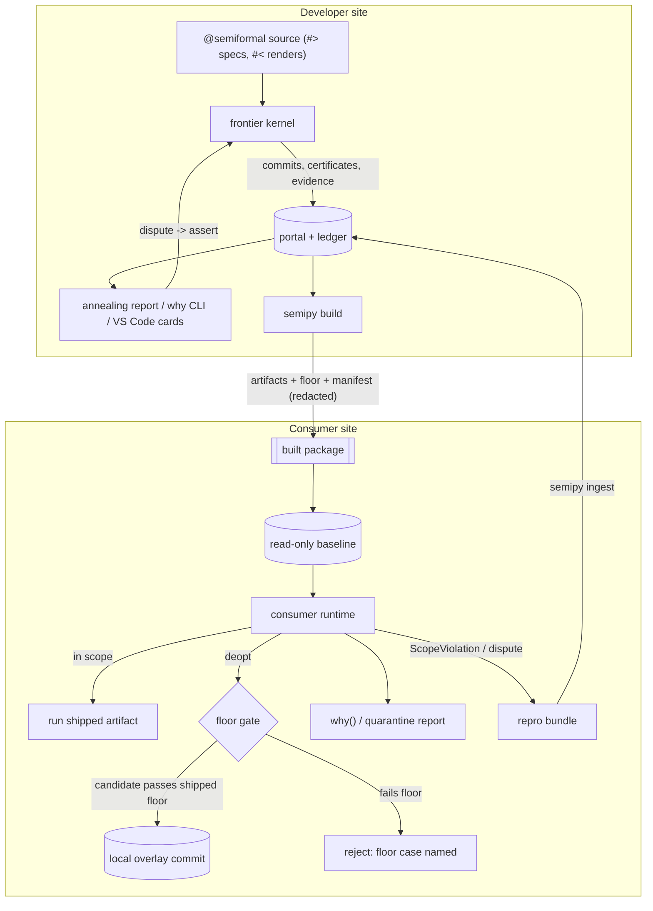
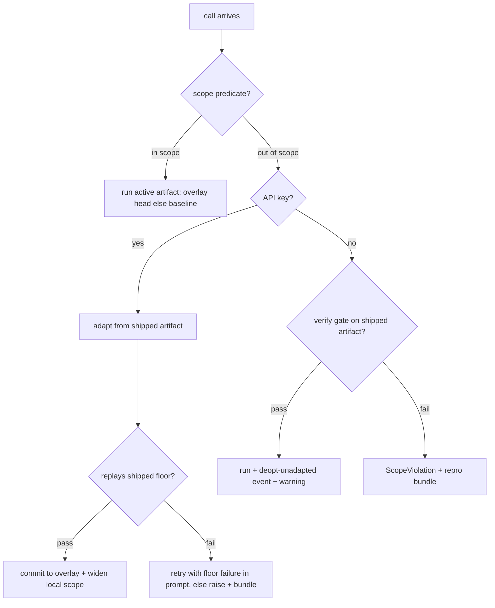

# feat: The Contract Surface for Two Personas

## Summary

Build the user-facing half of the contract surface (see origin): materialize each slot's
contract as a portable, diffable object; replace fingerprint equality with scope-predicate
membership; give **developers** an annealing report, a `why` query, and VS Code contract
cards layered over the existing `#<` ingestion; give **consumers** a `semipy build`
distribution where slots are **adaptive by default** — user-site regeneration is permitted
but gated by the shipped contract floor, so pitfalls the developer overcame cannot recur.
Five domain case studies (database layer, API gateway, web scraper, diagram library,
large-data ETL) drive the requirements.

---

## Problem Frame

The frontier kernel certifies decisions internally but exposes only code. Two personas pay
for that:

- **The developer authoring with semipy** sees generation streaming and a certificate
  hover, but has no per-output "why", no end-of-run account of what the kernel did, and no
  surface for disputing behavior short of editing specs or reading generated source.
- **The consumer of a library built with semipy** currently has nothing at all: no
  distribution story, no way to run without the author's cache directory, no statement of
  what inputs an implementation is certified for, and — if they regenerate — no protection
  against re-entering behaviors the developer's evidence already eliminated.

This plan answers the consumer-side questions directly (each resolved in Key Technical
Decisions): Do consumers get their own implementations? (Yes — adaptive by default, on a
local overlay.) How do we prevent them re-hitting overcome pitfalls? (The shipped contract
floor gates every user-site commit.) Do we share all versions? (No — evidence is the
compressed complement of version history.) How are test cases maintained? (A ledgered
lifecycle with rot revalidation and behavioral semver on contract diffs.)

---

## Domain Case Studies

These five studies are the requirements source. Each names representative slots, walks both
personas, states what stresses the design, and records what it derives. Requirement IDs
referenced here are defined in the next section.

### D1. Database layer

Representative slots: `#> normalize legacy customer rows to the Customer dataclass`
(pure), `#> upsert the record into customers, keyed on email` (effectful, via `fx`).

- **Developer flow.** Anneals against the dev database. The scope predicate is the
  introspected schema profile (columns, types, null rates). Effectful evidence is captured
  through the existing shadow-world replay, so idempotence of the upsert is a checkable
  property without touching a real database.
- **Consumer flow.** The consumer's schema *always* differs — extra columns, different
  legacy quirks. This is the domain that validates adaptive-by-default: a frozen-only
  library would deopt permanently on every install. On deopt, the consumer's regeneration
  is gated by the shipped floor: idempotent upsert (shadow replay), key-field non-null
  mapping, row-count preservation. Concrete developer rows must **not** ship — they are
  customer data.
- **Stress → derives:** the floor must be expressible as *properties*, not concrete I/O
  pairs (R14); external-input provenance so schema identity is recorded (R6); regimes per
  schema version so a consumer's migration is a branch, not a rewrite; redaction as a hard
  gate on shipping evidence (R14, U3).

### D2. API gateway / webhook normalizer

Representative slot: `#> normalize this vendor webhook payload into a CanonicalEvent`.

- **Developer flow.** Evidence is recorded payloads. Scope predicate = payload schema
  profile; regimes key on version fields when the vendor supplies them. Payloads contain
  secrets and PII, so redaction must run *before ledger persistence*, not only at ship
  time.
- **Consumer flow.** Same vendor, different account configuration — fields the developer
  never observed. Adaptive regeneration fires on deopt; the floor is required-field mapping
  properties plus the containment relation (every output field value traces to payload
  content — R20). When the vendor changes its payload globally, every consumer deopts at
  once: the developer ships a contract update, and behavioral semver (R2) tells consumers
  whether it is new evidence (patch), a new regime (minor), or changed pinned behavior
  (major).
- **Stress → derives:** redaction at capture time, not only ship time (U3); the
  upstream feedback channel — consumer deopt events are exactly the field intelligence the
  developer needs (R18); behavioral semver as the consumer's upgrade contract (R2).

### D3. Web scraper

Representative slot: `#> extract product name, price, and availability from this page`.

- **Developer flow.** The external source is hostile — pages drift constantly. Evidence
  cases are tied to page snapshots, which rot: a case that pinned last month's DOM is not
  evidence about today's site. Cases carry (locator, snapshot fingerprint, profile) so
  staleness is decidable (R6), and a revalidation cadence retires rotten cases with ledger
  events instead of silent deletion (R19).
- **Consumer flow.** All consumers scrape the same site, so a redesign is a synchronized
  deopt storm — the strongest possible signal to the developer, delivered as repro bundles
  (R18). Consumers cannot receive page snapshots (copyright, size); the floor that travels
  is the containment relation: extracted values must occur in the fetched page text modulo
  declared normalizers (R20). It is label-free and data-free.
- **Stress → derives:** the containment relation as a shippable, label-free extractor
  floor (R20, U11); case-rot policy (R19, U12); deopt storms as the motivating case for
  structured repro bundles (R18).

### D4. Diagram library

Representative slot: `#> lay out these nodes and edges as a readable SVG diagram`.

- **Developer flow.** Output quality is aesthetic — no usable `≈_Y`, so the slot never
  fully freezes (honest non-convergence, by design). But *sub-properties* are checkable:
  no overlapping node boxes, every edge endpoint references an existing node, output is
  well-formed SVG, deterministic under a seed. The contract is deliberately **partial**:
  hard invariants certified, aesthetics molten.
- **Consumer flow.** Consumers mostly run the shipped artifact; disputes are visual ("this
  looks bad"). A dispute either violates a hard invariant (a floor case — melt) or is
  taste (stays molten; recorded as an adjudication, never a certificate claim). `why()`
  must state the split honestly: *certified: invariants; uncertified: layout aesthetics*.
- **Stress → derives:** contracts must ship as partial objects with the certified/
  uncertified boundary explicit (R1, R8); the floor can be a strict subset of behavior and
  the manifest must say so (R11); dispute routing distinguishes invariant violations from
  taste (R10).

### D5. Large-data ETL

Representative slot: `#> clean and type these transactions` over a 100k-row DataFrame.

- **Developer flow.** Today's reuse fast path is unsound here: the DataFrame fingerprint
  is `shape:dtypes:hash(head(5))`, so a same-shape frame with a different tail skips
  verify entirely (origin §9.1). Scope membership over a data profile replaces hash
  equality (R3, R5). Verify above a size threshold runs on a stratified sample with the
  certificate recording the sampling power (kernel-plan §3.1 arithmetic, reused).
- **Consumer flow.** The consumer's 100k rows are a different distribution. In-scope rows
  run the shipped artifact at full speed; profile drift deopts to floor-gated adaptation.
  Row-level failures produce a quarantine report the consumer can query with per-row
  provenance — the element-frontier execution machinery itself is kernel-plan scope; this
  plan owns the scope guard and the report surfaces.
- **Stress → derives:** the fingerprint fix as an independent defect (R5, U2); scope
  predicates over data profiles (R3); sampled verify with stated power (R4); quarantine
  reporting as a first-class artifact for both personas (deferred surface — see Scope
  Boundaries).

---

## Requirements

**Contract object**

- R1. Every slot materializes a contract surface — spec text, types, scope predicate,
  regime guards, evidence cases (with provenance, holdout tag, ship flag), relations,
  certificate with explicit scope and certified/uncertified boundary — serialized as
  human-readable, diffable JSON with a schema version.
- R2. Contract diffs are classified by behavioral semver: evidence added = patch; scope
  widened or regime added = minor; pinned behavior changed (a case superseded or a
  certificate invalidated) = major.

**Scoped execution**

- R3. Committing/freezing mints a scope predicate (guard-DSL, compiled) from the evidence
  ledger's input profiles; the reuse fast path checks scope *membership*, not fingerprint
  equality.
- R4. An out-of-scope input never runs the artifact silently: at the developer's site it
  routes to verify/adapt; at the consumer's site it follows the resolution flow in
  High-Level Technical Design. Every deopt is a ledger event. Sampled verify (with
  recorded power) replaces whole-input verify above a size threshold.
- R5. The DataFrame/Series content-blindness defect is fixed with a regression test: two
  same-shape frames differing only beyond `head(5)` must not share a fingerprint.
- R6. External inputs (file, URL, API payload, DB schema) carry (locator, snapshot
  fingerprint, profile) provenance on their evidence entries.

**Developer surfaces**

- R7. An end-of-run annealing report (Rich) summarizes per-slot: decision, evidence delta,
  deopts, disputes, quarantines — in addition to the existing generation streaming.
- R8. `semipy why <file:line | slot_id>` renders an extensional explanation: certificate
  and scope, nearest evidence cases, regime and counterfactual, certified/uncertified
  boundary. No generated source, no LLM prose.
- R9. VS Code renders a contract card (hover) and a state CodeLens per slot, additive to
  `#<` skeleton lines; the portal is the single source of truth and both `#<` and
  decorations are renders of it.
- R10. A dispute flow runs from the surfaces (CLI and VS Code): the user marks an output
  wrong → recorded as an assert-style contract case → routed to the existing melt/ADAPT
  path. Diagram-style taste disputes are recorded as adjudications without becoming
  certificate claims.

**Distribution and consumer runtime**

- R11. `semipy build` distills the portal into package data: per-slot artifacts (one per
  regime), the shipped contract floor, and a manifest (schema version, slot modes,
  baseline content hash, semipy version). A built library imports and runs with no cache
  directory and no API key for in-scope calls.
- R12. Default slot mode is **adaptive**: a consumer-site deopt triggers floor-gated
  regeneration when an API key is present; the no-key path follows KTD-7.
- R13. The developer can pin a slot `frozen` (consumer regeneration forbidden; deopt
  raises with a repro bundle) or mark it `interpreted` (never freezes; requires a key).
- R14. The shipped floor defaults to properties: relations, guards, scope predicates,
  certificates, and only those concrete cases that pass redaction and carry `ship=true`.
  Cases whose inputs derive from external sources default to `ship=false`.

**Floor-gated user-site annealing**

- R15. The consumer portal is layered: a read-only shipped baseline plus a local overlay.
  A package upgrade replaces the baseline without touching the overlay; overlay commits
  reference the baseline version they were built against.
- R16. Every consumer-site candidate must replay-pass the shipped floor before commit;
  adaptation parents from the shipped artifact (never generates from scratch while a
  baseline exists).
- R17. Consumer-site provenance distinguishes `baseline-certified` from `locally-annealed`
  in `why()`, the ledger, and the quarantine/deopt events.

**Feedback and maintenance**

- R18. A structured, redacted repro bundle exports from any ScopeViolation, deopt, or
  dispute; `semipy ingest <bundle>` on the developer side creates a quarantined candidate
  case awaiting adjudication (never auto-activates).
- R19. Snapshot-tied evidence gets a revalidation policy: stale cases are retired with
  ledger events on a configurable cadence; retirement is never silent deletion.
- R20. A containment relation for extractor-category slots — each output field value must
  occur in the input text modulo declared normalizers — is available as a typed relation
  usable in shipped floors.

---

## Key Technical Decisions

- **KTD-1 — Adaptive by default.** Every shipped slot may regenerate at the consumer's
  site when its scope guard deopts, gated by the shipped floor (user decision).
  Consequences owned by this plan: consumers need an API key for adaptation (KTD-7 covers
  its absence); the developer's certificate describes the *baseline*, so all consumer-side
  surfaces must carry the `baseline-certified` / `locally-annealed` distinction (R17); the
  floor gate (R16) is therefore load-bearing safety infrastructure, not an optional extra,
  and lands before `build` ships to anyone.
- **KTD-2 — Evidence is the compressed complement of version history.** We ship the floor
  (what killed bad candidates), never the DAG (the search trajectory). A consumer-site
  candidate that would re-enter an eliminated behavior fails the floor case that
  eliminated it. This answers "do we share all versions?" — no, and sharing them would add
  nothing the floor doesn't already encode.
- **KTD-3 — `#<` ingestion stays default-on; decorations are additive** (user decision).
  The portal is the single source of truth; the skeleton writer and the VS Code
  decorations are both renders of it. Decorations carry only state absent from `#<` lines
  (hardness chip, case count, scope status) so the two never say different things.
- **KTD-4 — Property-first floor with capture-time redaction** (user decision). Redaction
  runs when evidence is persisted to the ledger, not only at ship time — D2 shows payloads
  contain secrets the developer's own disk shouldn't hold in the clear. Ship eligibility
  is a per-case flag defaulting by provenance (external-source-derived → `ship=false`).
- **KTD-5 — Layered portal, not merged history.** The shipped baseline is a read-only
  portal snapshot; consumer commits live in an overlay keyed by baseline version. Simpler
  than merging foreign commits into one DAG, makes package upgrades non-destructive, and
  keeps "what did the developer certify" answerable forever.
- **KTD-6 — Contract files are pretty-printed JSON** under `.semiformal/contracts/`
  (developer) and package data (shipped), reusing `semipy/contract/serialize.py`
  conventions. JSON over TOML: the serializers exist, round-trip is already tested, and
  diffability is adequate with sorted keys and one-case-per-entry formatting.
- **KTD-7 — No-key consumer behavior on deopt (adaptive slot):** run the shipped artifact
  under the verify gate; on verify pass, proceed and record a `deopt-unadapted` ledger
  event plus a warning; on verify failure, raise `ScopeViolation` carrying the repro
  bundle. Rationale: a keyless consumer should degrade to today's semipy behavior, not
  crash on every novel-but-handleable input; the verify gate is the existing safety net.
- **KTD-8 — Behavioral semver is advisory at the package boundary.** `semipy build`
  computes the contract diff against the previous baseline and refuses only on
  *misdeclared* releases (a major contract diff inside a declared patch release) — it
  cannot control the host package's versioning, so it warns and records the classification
  in the manifest.

---

## High-Level Technical Design

Two loops meet at the contract surface. The developer loop anneals and curates; the
consumer loop executes and feeds evidence back.

Consumer-site call resolution (adaptive slot):

`frozen` slots skip the KEYQ branch entirely (deopt → verify → run-or-raise);
`interpreted` slots skip the scope check (always molten, key required).

---

## Implementation Units

### Phase A — the contract object and scoped execution

### U1. Materialize and serialize the contract surface

- **Goal:** One queryable object per slot assembling what already exists (contract cases,
  guards, certificates, relations) plus the new fields (scope predicate ref, ship flags,
  certified/uncertified boundary), serialized to versioned JSON.
- **Requirements:** R1, R2
- **Dependencies:** none
- **Files:** `semipy/contract/surface.py` (new), `semipy/contract/serialize.py`,
  `semipy/contract/models.py` (add `ship` flag + provenance fields to `ContractCase`),
  `semipy/cli.py` (`contract show`, `contract diff`),
  `tests/unit/test_contract_surface.py` (new)
- **Approach:** `ContractSurface` is a *view* assembled from the slot's stored state — no
  new store. `contract diff` classifies per R2's behavioral-semver rules and prints the
  classification with the responsible entries. Schema version field from day one.
- **Test scenarios:** assembling a surface for a slot with cases + certificate + guards
  round-trips through JSON identically; a slot with no certificate yields a surface with
  an explicit `uncertified` marker (D4's partial contract); diff of two surfaces where
  only a case was added classifies `patch`; diff where a case was superseded classifies
  `major`; diff where a regime guard was added classifies `minor`; unknown schema version
  on load fails with a clear error.
- **Verification:** `semipy contract show <slot>` renders the D4 example with the
  certified/uncertified boundary visible; `contract diff` classifications match R2 on a
  constructed fixture set.

### U2. Scope predicates and the deopt path

- **Goal:** Replace reuse-fast-path fingerprint equality with membership in a compiled
  scope predicate minted from evidence profiles; fix the DataFrame tail-blindness defect;
  add sampled verify above a size threshold.
- **Requirements:** R3, R4, R5
- **Dependencies:** none (lands in parallel with U1; U1 consumes its predicate ref)
- **Files:** `semipy/kernel/guard.py` (extend the DSL with profile predicates: column
  set/type tests, null-rate and range bands, length bands), `semipy/kernel/operators.py`
  (mint scope at commit/freeze), `semipy/runtime_fingerprint.py`,
  `semipy/slot_resolver.py` (the reuse gate seam), `semipy/agents/validator.py` (sampled
  verify), `tests/unit/test_scope_predicates.py` (new),
  `tests/unit/test_runtime_fingerprint.py`
- **Approach:** Scope synthesis takes the ledger's input profiles and emits the coarsest
  DSL predicate consistent with all of them (MDL-flavored: prefer fewer conjuncts;
  over-tight scopes deopt constantly — track deopt frequency as a ledger statistic for
  later relaxation). Fingerprint equality survives as a fast pre-check (equal fingerprint
  ⇒ in scope); inequality falls through to the predicate instead of forcing verify.
  Fingerprint fix: fold a content signature over sampled rows (not just `head(5)`) into
  the frame/series branch. As an interim guard until the element frontier lands
  kernel-side, sampled verify also checks aggregate output sanity on collections
  (null-rate / empty-rate delta vs input — origin §9.2).
- **Execution note:** Write the failing tail-blindness regression test first (two frames,
  same shape and head, different tails) — it reproduces the origin §9.1 defect.
- **Test scenarios:** tail-blindness regression (must fail before the fix); an input
  matching the evidence profile passes scope without verify; a frame with a new column
  deopts with a ledger event naming the violated conjunct; scope synthesized from two
  profiles admits a third input between them (coarseness); sampled verify on a 100k-row
  frame runs on the sample size implied by (ε, δ) and records the power in the result;
  scalar slots behave exactly as today (single-particle cost property preserved).
- **Verification:** full suite green; the D5 fast-path walkthrough (same-shape different
  tail) now verifies instead of skipping; deopt events queryable per slot.

### U3. External-source identity and capture-time redaction

- **Goal:** Evidence entries carry (locator, snapshot fingerprint, profile) for external
  inputs; a redaction pass scrubs secrets/PII at ledger-persistence time and computes each
  case's default ship flag from provenance.
- **Requirements:** R6, R14
- **Dependencies:** U1 (ship flag field)
- **Files:** `semipy/documents.py`, `semipy/contract/redaction.py` (new),
  `semipy/contract/runner.py` (persist path), `tests/unit/test_redaction.py` (new)
- **Approach:** Redaction is pattern-based (bearer tokens, API-key shapes, emails, long
  digit runs) plus structural (fields named like secrets) — conservative and auditable;
  redacted spans are marked, not silently dropped, so a case remains honest about what it
  no longer pins. Provenance rule: case input derived from an external source →
  `ship=false` default; synthetic, relation-generated, or user-adjudicated → `ship=true`.
- **Test scenarios:** a webhook payload with an `Authorization` header persists with the
  token masked (D2); a case built from a PDF input records the locator and snapshot
  fingerprint; ship-flag defaults follow the provenance rule; a redacted case that loses
  its assertable target is auto-quarantined rather than silently weakened; re-running the
  same capture is idempotent (no double-masking).
- **Verification:** D2 walkthrough — capture a recorded payload, inspect the ledger file,
  confirm no secret material at rest and correct ship defaults.

### Phase B — developer surfaces

### U4. Annealing report and `semipy why`

- **Goal:** End-of-run Rich report of frontier activity; a CLI query rendering the
  extensional explanation for a slot or a `file:line`.
- **Requirements:** R7, R8
- **Dependencies:** U1 (surface object), U2 (deopt events)
- **Files:** `semipy/agents/console_messages.py`, `semipy/agents/console_core.py`,
  `semipy/cli.py` (`why`), `semipy/diagnostics_export.py`,
  `tests/unit/test_why_query.py` (new)
- **Approach:** The report aggregates the run's ledger deltas per slot (decision label,
  cases added, deopts, disputes, quarantines) — one compact table after execution,
  streaming panel unchanged. `why` renders: spec, active commit + decision, certificate +
  scope with in/out verdict for a supplied input, nearest cases (profile-distance over
  fingerprint components), regime counterfactual when guards exist, certified/uncertified
  boundary. Explicitly no generated source and no model calls.
- **Test scenarios:** `why` on a slot with a certificate renders scope and (ε, δ); `why`
  with a sample input reports in-scope/out-of-scope and, when out, the violated conjunct;
  `why` on a D4-style partial contract states the certified/uncertified split; nearest-case
  selection returns the case sharing the input's profile over an unrelated one; report
  after a run with one GENERATE and one deopt shows both rows; `verbose=False` still
  produces the report unless also disabled.
- **Verification:** run `examples/apache_log_semiformal_stages.py`; the report appears and
  `semipy why` answers for its slots without touching the network.

### U5. VS Code contract card, state CodeLens, and dispute flow

- **Goal:** Hover card and CodeLens rendering contract state; a dispute action that records
  an assert case; decorations additive to `#<` per KTD-3.
- **Requirements:** R9, R10
- **Dependencies:** U1, U4 (`why` internals reused via portal/diagnostics JSON)
- **Files:** `semipy-vscode/src/features/contractCard/contractHover.ts` (new),
  `semipy-vscode/src/features/contractCard/contractCodeLens.ts` (new),
  `semipy-vscode/src/data/portalLoader.ts` (read surfaces), `semipy-vscode/src/extension.ts`,
  `semipy/cli.py` (dispute lands via existing `assert-decision` plumbing),
  `semipy-vscode/src/test/contractCard.test.ts` (new)
- **Approach:** Follow the existing feature layout (`features/decisions/*` is the pattern:
  hover + CodeLens + insight). The CodeLens line: hardness chip, case count, scope status,
  regime count. Hover: the U1 surface rendered compact. Dispute: command palette + hover
  action → input box for expected behavior → invokes the CLI `assert-decision` path →
  diagnostics refresh. Decorations show nothing that `#<` lines already say (KTD-3).
- **Test scenarios:** CodeLens appears on a slot with a committed surface and not on plain
  functions; hover on D4's slot shows the certified/uncertified boundary; dispute action
  round-trips into a quarantine-or-assert case visible in the version tree; a portal with
  no contract surface degrades to the current decision hover (back-compat); `#<` lines
  present + decorations enabled produce no duplicated text.
- **Verification:** extension test suite green; manual walkthrough on the examples folder
  showing card, lens, and a dispute landing in the ledger.

### Phase C — distribution

### U6. `semipy build` and the consumer runtime

- **Goal:** Distill a portal into package data (artifacts per regime, shipped floor,
  manifest) and provide the consumer-side runtime that resolves calls per the HTD flow —
  no cache dir, no key needed for in-scope calls.
- **Requirements:** R11, R12 (resolution flow), KTD-7
- **Dependencies:** U1, U2, U3
- **Files:** `semipy/distribution/__init__.py`, `semipy/distribution/build.py`,
  `semipy/distribution/runtime.py`, `semipy/distribution/manifest.py` (all new),
  `semipy/cli.py` (`build`), `semipy/slot_resolver.py` (baseline-aware resolution seam),
  `tests/unit/test_build_distill.py`, `tests/integration/test_consumer_runtime.py` (new)
- **Approach:** `semipy build` writes `_semiformal/` package data next to the library's
  modules: `manifest.json` (schema version, baseline content hash, per-slot mode +
  artifact refs + contract path, semver classification vs previous baseline per KTD-8),
  one artifact module per slot (regime-guard dispatch included), one contract JSON per
  slot (floor-filtered per R14). The runtime shim resolves slots against package data
  before the cache-dir path; in-scope calls never import LLM machinery. KTD-7's verify
  fallback reuses `verify_runtime_execution`.
- **Test scenarios:** build a fixture project, install into a clean venv without
  `OPENAI_API_KEY`: in-scope call runs and returns; out-of-scope call on an adaptive slot
  without key → verify-pass path runs with `deopt-unadapted` event and warning;
  verify-fail path raises `ScopeViolation` whose bundle names the violated conjunct;
  frozen slot deopt raises without attempting adaptation; manifest baseline hash changes
  iff any shipped artifact or contract changed; a floor case with `ship=false` is absent
  from the built package data; build against a previous baseline with a superseded case
  classifies `major` and warns on a declared patch release (KTD-8).
- **Verification:** the integration test runs the built fixture end-to-end in a keyless
  subprocess; wheel contents inspected for absence of unshipped evidence.

### U7. Slot distribution modes

- **Goal:** Developers mark slots `frozen` / `adaptive` / `interpreted`; default adaptive;
  modes flow into the manifest and gate consumer-site behavior.
- **Requirements:** R12, R13
- **Dependencies:** U6
- **Files:** `semipy/decorator.py` (per-slot marking via decorator kwarg), `semipy/types.py`
  (`SlotSpec` field), `semipy/distribution/manifest.py`, `semipy/distribution/runtime.py`,
  `tests/unit/test_distribution_modes.py` (new)
- **Approach:** Mode is authored where the slot is authored (decorator argument with
  per-slot override map for multi-slot functions), not in a side file — the spec and its
  distribution posture read together. `interpreted` slots reuse the existing
  interpreted-tier flag; build refuses to ship an `interpreted` slot as anything else.
- **Test scenarios:** default (unmarked) slot manifests as adaptive; frozen slot's deopt at
  consumer site raises with bundle and never calls the generation path (asserted via a
  stub); an interpreted slot without a key at consumer site raises a clear configuration
  error at call time, not import time; mode changes flip the manifest and register as a
  `minor` contract diff.
- **Verification:** matrix test covering mode × key-present × in/out-of-scope against the
  HTD resolution flow.

### Phase D — floor-gated user-site annealing

### U8. Layered portal: baseline + overlay

- **Goal:** Consumer-site portal state is a read-only shipped baseline plus a local
  overlay; upgrades replace the baseline non-destructively.
- **Requirements:** R15, R17
- **Dependencies:** U6
- **Files:** `semipy/distribution/baseline.py` (new), `semipy/store.py` (resolution
  order: overlay head → baseline artifact), `semipy/session_anchor.py` (anchor consumer
  overlay to the consuming project, not the library), `tests/unit/test_layered_portal.py`
  (new)
- **Approach:** The baseline is the built package data, never written. The overlay is an
  ordinary portal in the consumer project's `.semiformal/`, whose commits carry
  `baseline_version`. Active-implementation rule extends: overlay head wins if present
  and its `baseline_version` matches the installed baseline; a baseline upgrade demotes
  stale overlay commits to `needs-revalidation` (they re-enter via the floor gate on next
  call) rather than deleting them.
- **Test scenarios:** first consumer call resolves to baseline artifact; after a local
  adaptation, resolution prefers the overlay head; upgrading the package (new baseline
  hash) marks the overlay commit stale and the next call re-runs the floor gate against
  the *new* floor; `why()` on a baseline resolution says `baseline-certified`, on an
  overlay resolution says `locally-annealed` with the baseline it extends; deleting the
  overlay restores pristine shipped behavior.
- **Verification:** upgrade walkthrough in the integration fixture: adapt locally, bump
  the library, observe revalidation instead of silent reuse or silent loss.

### U9. The floor gate

- **Goal:** No consumer-site candidate commits without replay-passing the shipped floor;
  adaptation parents from the shipped artifact.
- **Requirements:** R16
- **Dependencies:** U6, U8
- **Files:** `semipy/distribution/floor_gate.py` (new), `semipy/slot_resolver.py`
  (generate/adapt gate seam — the existing `_run_generate_contract_gate` is the pattern),
  `tests/unit/test_floor_gate.py` (new)
- **Approach:** The gate replays shipped relations, guards, and `ship=true` cases against
  the candidate; failure feeds the failing floor entry into the retry prompt (same shape
  as today's contract-gate retry) and, on budget exhaustion, raises with the entry named —
  it never commits a floor-violating candidate and never quarantines a *shipped* case
  (shipped floor is immutable at the consumer site; that is the pitfall-preservation
  invariant). Adaptation passes the shipped artifact as parent source.
- **Execution note:** Write the pitfall-preservation test first: a floor case that
  eliminated a known-bad behavior, a stubbed generator that re-proposes exactly that
  behavior, and an assertion that the commit is refused with that case named.
- **Test scenarios:** the pitfall-preservation test above; a candidate passing the floor
  but failing a *local* overlay case is handled by the normal local contract gate (floors
  compose, not replace); relations in the floor (D3 containment) gate a candidate with a
  hallucinated output field; effectful floor entries replay in a shadow world, never
  against the consumer's live resources; gate cost is bounded (floor replay count logged).
- **Verification:** D1 walkthrough — consumer schema triggers adaptation; the shipped
  idempotence property survives into the adapted implementation.

### U10. Feedback channel: repro bundles and ingestion

- **Goal:** Deopts, ScopeViolations, and disputes export a structured redacted bundle;
  developers ingest bundles as quarantined candidate cases.
- **Requirements:** R18
- **Dependencies:** U3 (redaction), U6
- **Files:** `semipy/distribution/repro.py` (new), `semipy/cli.py` (`ingest`),
  `semipy/contract/maintainer.py` (quarantine intake), `tests/unit/test_repro_bundle.py`
  (new)
- **Approach:** Bundle = slot id, baseline version, mode, event kind, scope-violation
  detail (violated conjunct + observed profile), redacted minimal input when policy
  allows, environment digest. `ingest` validates the bundle against the developer's
  portal (slot exists, baseline known) and files a quarantined case with provenance
  `consumer-report` — adjudication (existing pick/assert surfaces) is what activates it.
- **Test scenarios:** bundle from a ScopeViolation contains the violated conjunct and no
  raw secret material (reuses U3 patterns on the bundle path); ingest of a valid bundle
  creates a quarantined case visible in `contract show`; ingest of a bundle against an
  unknown baseline errors with guidance rather than filing a misleading case; ingest is
  idempotent on the same bundle; adjudicating the case activates it and routes the slot
  through the melt path on next run.
- **Verification:** round-trip demo — consumer fixture raises, bundle file ships across,
  `semipy ingest` files it, adjudication triggers ADAPT on the developer side.

### Phase E — evidence maintenance

### U11. Containment relation for extractors

- **Goal:** The typed relation "every output field value occurs in the input text modulo
  declared normalizers", registered for extractor-category slots and usable in shipped
  floors.
- **Requirements:** R20
- **Dependencies:** U1 (relations serialize into surfaces)
- **Files:** `semipy/contract/relations.py`, `tests/unit/test_containment_relation.py`
  (new)
- **Approach:** Normalizers are a small declared set (case-fold, whitespace collapse,
  numeric parsing, date reformatting) recorded with the relation instance — containment
  without declared normalizers is too strict for real extractors (a parsed price `1299.0`
  vs source `"$1,299"`), with them it stays label-free and checkable. Applies to
  str/record-output slots whose inputs include a text field; category detection reuses the
  slot's type layer, no LLM.
- **Test scenarios:** extractor output traceable to page text passes; a hallucinated field
  value fails naming the field; price/date normalizer cases pass under declared
  normalizers and fail without them; relation on a non-extractor slot is rejected at
  registration; the relation serializes into a shipped floor and evaluates at the
  consumer site with no snapshot data present (D3).
- **Verification:** D3 fixture — a scraper slot floor with containment blocks a
  field-inventing candidate in the U9 gate.

### U12. Case lifecycle: rot revalidation and semver enforcement

- **Goal:** Snapshot-tied cases revalidate on a cadence and retire with ledger events;
  contract-diff classification (U1) is enforced at build time per KTD-8.
- **Requirements:** R19, R2
- **Dependencies:** U1, U3 (snapshot provenance), U6 (build hook)
- **Files:** `semipy/contract/maintainer.py`, `semipy/distribution/build.py` (semver
  check), `semipy/cli.py` (`contract revalidate`), `tests/unit/test_case_rot.py` (new)
- **Approach:** Revalidation is explicit (`contract revalidate`, and a build-time check),
  not a daemon: a case whose snapshot fingerprint no longer matches its locator's current
  content is marked `stale`; stale beyond the configured age retires with a
  `case-retired(rot)` ledger event. Retired cases leave the active floor but remain in
  history. Build refuses per KTD-8 misdeclarations and records the classification.
- **Test scenarios:** a case tied to a changed fixture file marks stale on revalidate; a
  stale case past the age threshold retires with a ledger event and drops from the built
  floor; a still-matching snapshot stays active; retirement of a case that a certificate
  depended on flags the certificate for re-licensing rather than silently keeping it;
  build with a superseded case + declared patch version fails with the R2 classification
  in the message.
- **Verification:** D3 rot walkthrough — fixture page changes, revalidate marks and then
  retires the case, subsequent build's floor and manifest reflect it.

---

## Scope Boundaries

**Deferred to Follow-Up Work**

- Element-frontier execution (per-row routing, quarantine partitions) and its report
  surfaces — kernel-plan consumers of the Phase 1 tree; this plan ships the scope guards
  (U2) they will sit behind.
- Run-as-transaction semantics (mid-run checkpointing, prefix-replay obligation, CUSUM/SPRT
  sequential drift trigger for streaming — origin §5) — depends on the element frontier
  above and lands with it on the kernel track.
- Mining discriminating inputs from real data streams (origin §6c) — an extension of the
  kernel plan's discriminating-input search, not of these surfaces.
- Inverse synthesis and the full typed metamorphic-relation registry — kernel-plan Phase 4
  track (user decision); U11's containment relation is the one relation this plan needs.
- VS Code candidate-gallery adjudication for visual domains (D4) — the CLI/hover dispute
  flow (U5) covers the near term.
- Consumer-side `why()` webview or rich UI — CLI rendering only in this plan.
- Automatic telemetry upload of consumer events — bundles are explicit, user-initiated
  artifacts by design; auto-upload is a privacy decision not taken here.

**Outside this plan's identity**

- Changes to the annealing calculus (freeze/melt/branch/merge semantics) or the
  certificate mathematics — owned by the frontier-kernel plan.
- LLM-judged verification of any kind — excluded by the origin's trust hierarchy.

---

## Risks & Dependencies

- **Adaptive-by-default raises the stakes on the floor gate (KTD-1).** A weak floor means
  consumer-site drift from developer intent with a certificate that no longer describes
  reality. Mitigations: R17's provenance labeling is mandatory in every surface; U9 lands
  before `build` is documented as ready; the D1/D3 walkthroughs are the acceptance bar.
- **Scope-predicate overfitting** (origin §10): too-tight scopes deopt constantly, which
  under KTD-1 means consumer LLM spend. Deopt frequency is a ledger statistic from U2 day
  one; scope synthesis prefers coarseness by construction.
- **Redaction is pattern-based and will miss things.** It is a floor, not a proof;
  `ship=false`-by-provenance (KTD-4) is the real guard for external data, redaction is
  defense in depth for what does ship.
- **Kernel-plan coupling.** U2 extends the guard DSL and freeze path that the kernel plan
  owns; sequence those edits against that plan's Phase 5 status (guard DSL exists, merge
  does not — safe today, re-check at execution).
- **Consumer environments without pandas/rich** must still run built packages: the
  distribution runtime keeps imports lazy and degrades profile predicates to the
  structural subset when pandas is absent.

---

## Open Questions

- Should a consumer be able to *tighten* the floor locally (add their own must-hold cases
  that gate future local adaptations)? Likely yes and cheap (the overlay already holds
  local cases; the U9 gate composes them), but deferred until a real consumer workflow
  demands it.
- Minimal-input inclusion policy in repro bundles: default include-redacted vs
  default-exclude (profile only). Shipped default in U10 is profile-only with an
  opt-in flag; revisit after the first D2-style field report.
- Where the consumer overlay anchors when the consuming project itself uses semipy
  (nested portals): U8 anchors by consuming project root; a library-per-overlay split is
  the fallback if collisions appear.
