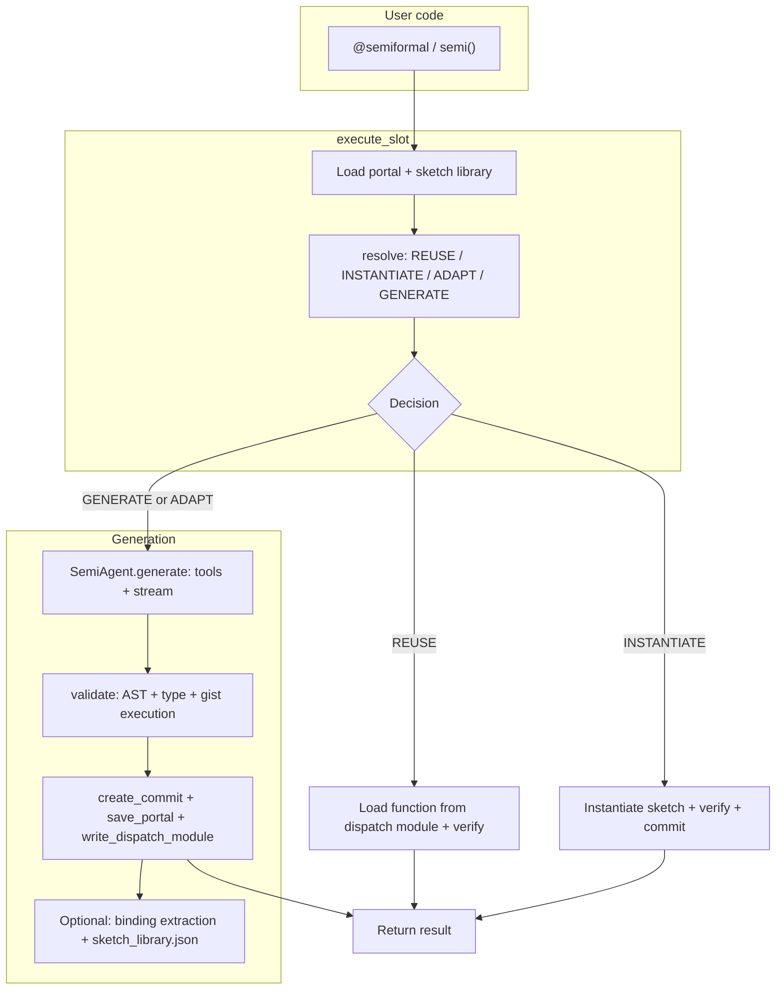

# Semipy walkthrough: Apache log compiler

This document is the **usage scenario** for semipy: it follows the runnable script [`apache_log_semiformal_stages.py`](apache_log_semiformal_stages.py) line-for-line for examples, then explains what you **see** in the editor and terminal, and how the **runtime architecture** (slots, cache, sketches, gists, execution) fits together. After reading it, you should understand how the codebase behaves without opening every module first.

## Framing

**SRE onboarding a new Apache deployment into a structured observability pipeline.**

Raw Apache error logs are useful for humans; downstream systems need structured events. Each deployment has a slightly different message ecology. Hand-authoring all regexes is expensive; classifying every line with an LLM at runtime is costly and unstable.

The semiformal approach: express two **natural-language** contracts in Python (`@semiformal` + `#>`), let the agent **generate** implementations once, **cache** them in a per-session portal, then run **deterministic** parsing for the full corpus. When data or contracts change, **verify** decides whether to **reuse**, **instantiate** a learned pattern, **adapt**, or **regenerate**.

## Files

| File | Purpose |
|------|---------|
| [`apache_log_semiformal_stages.py`](apache_log_semiformal_stages.py) | Formal helpers (`CompiledParser`, prefix regex) + `ApacheLogPipeline` with `@semiformal` methods; CLI stages 1–6 |
| [`data/Apache_2k.log`](data/Apache_2k.log) | 2000-line Apache error log |
| [`sketch_pattern_learn_demo.py`](sketch_pattern_learn_demo.py) | Minimal DataFrame filter demo for **INSTANTIATE** only (complement to STAGE 6 here) |

Cache and artifacts (created when you run the script) live under `examples/.semiformal/` when `configure(cache_dir=...)` points there (the script sets `cache_dir` to `examples/.semiformal`).

## Running (aligned with the script)

From the **repository root** (the script pins `cache_dir` and `session_source` to `examples/` so paths are cwd-independent):

```bash
uv sync
source .venv/bin/activate

# Stage 1 only (classify unique bodies)
uv run python examples/apache_log_semiformal_stages.py --fresh --stage 1

# Stages 1+2 (classify + infer regex templates)
uv run python examples/apache_log_semiformal_stages.py --fresh --stage 2

# Full path through formal parse (no LLM in stage 3)
uv run python examples/apache_log_semiformal_stages.py --fresh --stage 3

# Extension + edge cases
uv run python examples/apache_log_semiformal_stages.py --stage 4

# Malformed lines through the formal parser
uv run python examples/apache_log_semiformal_stages.py --stage 5

# Pattern learning: GENERATE then INSTANTIATE (optional control with --pattern-gamma)
uv run python examples/apache_log_semiformal_stages.py --fresh --stage 6
uv run python examples/apache_log_semiformal_stages.py --fresh --stage 6 --pattern-gamma
```

**Environment:** `OPENROUTER_API_KEY` is required for generation. Optional: `OPENAI_API_KEY` (used for sketch binding classification / Responses per project defaults), `E2B_API_KEY` for sandboxed gist execution (see below). Full pipeline tracing: `SEMIPY_PIPELINE_TRACE=1`.

**VS Code:** `semipy.sessionSource` must match the **same absolute path string** the runtime uses for `configure(session_source=...)`. If the workspace root is the repo, use `examples` as the session source, e.g. `${workspaceFolder}/examples` in settings, so the extension’s portal and decorations align with the script.

---

## What you see: terminal (`semipy/agents/console_io.py`)

With `configure(verbose=True)` (the script default), generation is explained in **plain language**, not cache jargon.

**Resolution and pipeline lines**

- `pipeline_resolution_message` maps each [`Decision`](../semipy/types.py) to a short reason, for example:
  - **GENERATE:** “No reusable implementation; creating a new one.”
  - **REUSE:** “Using a matching cached implementation.”
  - **ADAPT:** “No exact reuse; adapting from a previous version and generating code.”
  - **INSTANTIATE:** “Matching a learned pattern; substituting parameters without generation.”
- While the agent runs, status lines use **Implementing code** / **Adjusting implementation after validation** (`pipeline_generate_status`) instead of lower-level phrasing.
- After a successful **INSTANTIATE** path, `execute_slot` logs a **semipy** line with stage `instantiate` and the message: **“Reusing learned pattern with parameter substitution; no generation needed.”** (see [`slot_resolver.py`](../semipy/slot_resolver.py) around the INSTANTIATE branch.)
- On **REUSE**, repeated identical lines for the same file/function can be **batched** (repeat count and collapsed line range) so per-row classification does not flood the terminal (`flush_pipeline_log_pending` / aggregation in `console_io.py`).

**Stream UI**

- [`effective_stream_display_mode`](../semipy/agents/config.py) uses **peek** mode when `verbose=True`: a rolling tail of model output plus optional timeline/elapsed behavior (constants `STREAM_PEEK_LINES`, `STREAM_TIMELINE`, `STREAM_SHOW_ELAPSED` in `agents/config.py`).
- In **Jupyter**, output can be funneled through a single `ipywidgets.Output` via `jupyter_capture_console()` so cells do not accumulate dozens of separate outputs.

**Validation**

- Panels for validation failures (syntax, types, execution checks) use Rich `Panel` / `Syntax` / `Table` as appropriate (`console_io.py`).

---

## What you see: VS Code (`semipy-vscode/`)

The extension is described in [`package.json`](../semipy-vscode/package.json): editor support for semiformal specs (`#>` / `#<`), portal history, and navigation to generated dispatch code.

**Settings that matter**

- **`semipy.sessionSource`:** Absolute path that must match `configure(session_source=...)`.
- **`semipy.enableSpecLineSyntax`:** Decorations for `#>` / `#<` markers and bodies.
- **`semipy.enableInlayHints`:** Last resolution (decision, commit id) near spec lines.
- **`semipy.enableCodeLens`:** Semipy commit/version CodeLens above `@semiformal` functions.
- **`semipy.debounceMs`:** How often `.semiformal` artifacts reload (portals, `sketch_library.json`).
- **`semipy.tracePhraseDecorations`:** Debug logging for phrase/binding resolution in **Output > Semipy**.

**Pattern learning highlights**

[`phraseDecorations.ts`](../semipy-vscode/src/features/phraseHighlight/phraseDecorations.ts) paints **spec phrases** by semantic role (`operation`, `param`, `operator`, `connective`) using merged data from the portal and `sketch_library.json` (see `loadSketchLibraryMerged` / `sketchLoader`). That is the visual link between **NL spec text** and **learned bindings** after GENERATE/ADAPT.

**Commands**

- Open dispatch **split view**, refresh **slot history**, view **generated code** for a commit, **show output** log, optional **regenerate** diagnostic (CLI).

---

## Pipeline decomposition (this example)

### Formal layer (no LLM)

- **Prefix regex** (`APACHE_ERROR_PREFIX`): timestamp, level, body. Mismatch yields `PREFIX_FAIL` in `CompiledParser.parse_line`.
- **`CompiledParser`:** Deterministic match of body against per-family regexes; `OK`, `UNSEEN_TEMPLATE`, or `AMBIGUOUS`.
- **Error reporting:** Malformed lines are handled here; the classifier slot is **not** called for them (STAGE 5).

### Semiformal layer (LLM on first resolution per slot, then cache)

**`#>` vs `#<`:** `#>` lines are **contract text** (hashed into `spec_text` / `spec_equivalence_key`). `#<` lines are **reasoning surfaces**; they are stripped for lowering so they do not change slot id ordinals. Promoting `#<` to `#>` changes the contract (see STAGE 7).

**Methods in [`ApacheLogPipeline`](apache_log_semiformal_stages.py):**

1. **`classify_body`** — STATEMENT_BLOCK: static `#>` text; runtime variation is the `body` argument. First unique body → **GENERATE**; further bodies → **REUSE** + `verify_runtime_execution` (or **ADAPT** on failure).
2. **`infer_templates`** — STATEMENT_BLOCK with `templates = ...` and `#>` continuations: static spec; `bodies` carries grouping. Same equivalence key across runs; new data → **REUSE** + verify unless input fingerprint matches.
3. **`body_contains_literal_alpha` / `beta` / `gamma`** — STAGE 6: paired **substring** checks. Alpha and beta use the **same token pattern** with different quoted literals (`"mod_jk"` vs `"scoreboard"`). Gamma uses a **different** spec shape (first non-whitespace character vs `[`) for a **control** run: expect **GENERATE** or **ADAPT**, not **INSTANTIATE**, when `--pattern-gamma` is set.

---

## Architecture: end-to-end flow

High-level path (see also [`CLAUDE.md`](../CLAUDE.md) in the repo root):



**Portal and dispatch**

- Session state: `.semiformal/{session_id}.portal.json` (DAG: slots, commits, branches, refs).
- **Dispatch module:** `.semiformal/runtime/{module_name}.semi.py` — compiled implementations for import; `write_dispatch_module` keeps it in sync with the portal and optional sketch metadata.

**`resolve` precedence** (simplified; see [`resolver.py`](../semipy/resolver.py))

1. No slot in portal → **GENERATE**
2. `force_regenerate` → **ADAPT** or **GENERATE** depending on parents
3. Local commits + equivalence matches → **REUSE**
4. Equivalence mismatch or empty slot: try **cross-slot donor REUSE** (`spec_equivalence_key`), then **sketch INSTANTIATE**, then **ADAPT** / **GENERATE**

**Runtime verify**

- `verify_runtime_execution` checks type, execution, and data-agnostic guards (empty string identity, etc.) on **REUSE** when the fingerprint changed; see [`CLAUDE.md`](../CLAUDE.md) for reuse vs verify skip.

**Pattern learning (sketch library)**

- After **GENERATE** / **ADAPT**, binding extraction (`semipy/library/binding.py`) can align NL phrases with code fragments and write **`sketch_library.json`** (disable with `configure(sketch_library_learning=False)`).
- The extraction prompt includes rules for **parametric literals**: when the same sentence shape repeats and only quoted literals or identifiers change, those should be **holes** so another spec can **instantiate** the same code shape (see `_extraction_prompt` in `binding.py`).
- **`find_sketch_match`** (`semipy/library/sketch.py`) aligns tokens to `spec_template`; **`instantiate_sketch_code`** substitutes holes; **`execute_slot`** validates instantiated source and, on success, records a commit with decision **INSTANTIATE**.
- **`sketch_library_learning_async`:** if `True`, extraction runs in a background thread (lower latency; same-process **INSTANTIATE** immediately after the first slot may not see the new sketch).

**Gist validation and E2B**

- The agent uses **`build_and_run_gist`** (see [`gist.py`](../semipy/agents/gist.py)) to test generated code in isolation.
- [`GistExecutor`](../semipy/agents/executor.py) runs gists in an **E2B** sandbox when `use_e2b` and `E2B_API_KEY` are set; otherwise **subprocess** fallback. This keeps validation reproducible without mutating the user environment.

---

## Decision map (conceptual)

```
execute_slot
  -> load portal, resolve(sketch_library=...)
       |
       +-- REUSE (local or donor) -> load dispatch fn -> optional verify -> return
       +-- INSTANTIATE -> instantiate sketch -> verify -> commit -> return
       +-- GENERATE / ADAPT -> agent -> validate (incl. gist) -> commit -> sketch extraction -> return
```

Summary table (same spirit as the older doc):

| Situation | Typical decision | LLM generation? |
|-----------|------------------|-----------------|
| First resolution for a slot | GENERATE | Yes |
| Same slot, same fingerprint as prior verify | REUSE (may skip verify) | No |
| Same slot, new inputs | REUSE + verify | No |
| Verify fails | ADAPT | Yes |
| Edited `#>` spec | New equivalence key | GENERATE or ADAPT |
| Another call site, same equivalence key | REUSE (donor) | No |
| New slot, same structural pattern as a sketch, new param literals | INSTANTIATE | No (substitution + verify) |
| Malformed log line | Formal parser only | No |

---

## Stages (match `apache_log_semiformal_stages.py`)

### STAGE 1 — Classify bootstrap bodies

Extract bodies from the first `bootstrap_n` lines (default 120), classify **unique** bodies. First body → **GENERATE**; remaining → **REUSE** + verify.

Typical families (narrow bootstrap): on the order of three recurring families in the first ~120 lines (see “Data patterns” below).

### STAGE 2 — Generate regex templates

`infer_templates(group_by_family(...))` — first call → **GENERATE**; produces `FamilyTemplate` list with regex patterns and field metadata.

### STAGE 3 — Formal parse

`CompiledParser.batch_parse` over the full log — **no LLM**.

### STAGE 4 — Extension

Bootstrap narrow set, then widen with appended **edge** lines. `classify_body` **REUSE**s for all bodies. `infer_templates` sees a **larger** grouping — same **spec**, new runtime data → **REUSE** + verify (or **ADAPT** if verify fails).

### STAGE 5 — Error reporting

Malformed lines go through **`CompiledParser`** only; classifier is not invoked. Expect `PREFIX_FAIL` / `UNSEEN_TEMPLATE` as appropriate.

### STAGE 6 — Pattern learning (sketch / INSTANTIATE)

1. **`body_contains_literal_alpha`** on a line containing **`mod_jk`** → **GENERATE**; sketch extraction runs after commit.
2. **`body_contains_literal_beta`** on a line containing **`scoreboard`** → expect **INSTANTIATE** if the sketch matches (same shape, different quoted literal).
3. With **`--pattern-gamma`**, **`body_contains_literal_gamma`** checks a **different** spec (“first non-whitespace character is `[`”) → expect **GENERATE** or **ADAPT**, not **INSTANTIATE**, as a negative control.

For a minimal parallel demo without Apache context, see [`sketch_pattern_learn_demo.py`](sketch_pattern_learn_demo.py) (DataFrame filters).

### STAGE 7 — Promote `#<` into `#>` (manual)

Not a CLI flag: after **GENERATE** / **ADAPT**, the skeleton writer may add **`#<`** lines ([`skeleton_writer.py`](../semipy/agents/skeleton_writer.py)). To make reasoning **durable contract**, copy or convert those lines into **`#>`** in the same contiguous block. That changes `spec_text` and thus `spec_equivalence_key`, so the next run may **GENERATE** or **ADAPT** under the new NL contract. Re-run with `--fresh` or rely on verify failure to drive **ADAPT**.

---

## Data patterns in `Apache_2k.log`

The first ~120 lines contain a small set of recurring body families (worker init, mod_jk, scoreboard). Later lines introduce additional patterns (directory index, rare jk variants, etc.). STAGE 4 appends synthetic edge lines to stress-test classification and templates.

---

## Key source files (navigation)

| File | Role |
|------|------|
| [`semipy/decorator.py`](../semipy/decorator.py) | `@semiformal` |
| [`semipy/lowering.py`](../semipy/lowering.py) | `#>` / `#<`, `SlotSpec`, scaffolds |
| [`semipy/semi_fn.py`](../semipy/semi_fn.py) | `semi()` |
| [`semipy/resolver.py`](../semipy/resolver.py) | Resolution: **REUSE**, **INSTANTIATE**, **ADAPT**, **GENERATE** |
| [`semipy/slot_resolver.py`](../semipy/slot_resolver.py) | `execute_slot`, portal load, verify, materialize, INSTANTIATE branch |
| [`semipy/agents/agent.py`](../semipy/agents/agent.py) | `SemiAgent.generate` |
| [`semipy/agents/gist.py`](../semipy/agents/gist.py), [`executor.py`](../semipy/agents/executor.py) | Gist build/run; E2B vs subprocess |
| [`semipy/agents/validator.py`](../semipy/agents/validator.py) | Generation-time validation; runtime verify helpers |
| [`semipy/agents/console_io.py`](../semipy/agents/console_io.py) | Terminal / Jupyter UX |
| [`semipy/library/binding.py`](../semipy/library/binding.py) | Binding extraction prompt + `SemanticBinding` |
| [`semipy/library/sketch.py`](../semipy/library/sketch.py), [`sketch_store.py`](../semipy/library/sketch_store.py) | Sketches and `sketch_library.json` |
| [`semipy/store.py`](../semipy/store.py) | Dispatch module writing |
| [`semipy/session_anchor.py`](../semipy/session_anchor.py) | Portal anchor (notebooks vs files) |
| [`semipy/history/version_control.py`](../semipy/history/version_control.py) | Commits, branches, slots |

---

## Deep trace

```bash
SEMIPY_PIPELINE_TRACE=1 uv run python examples/apache_log_semiformal_stages.py --fresh --stage 2
```

This prints prompts, tool calls, and reasoning dumps for debugging generation (environment-only; not `SemiConfig`).
